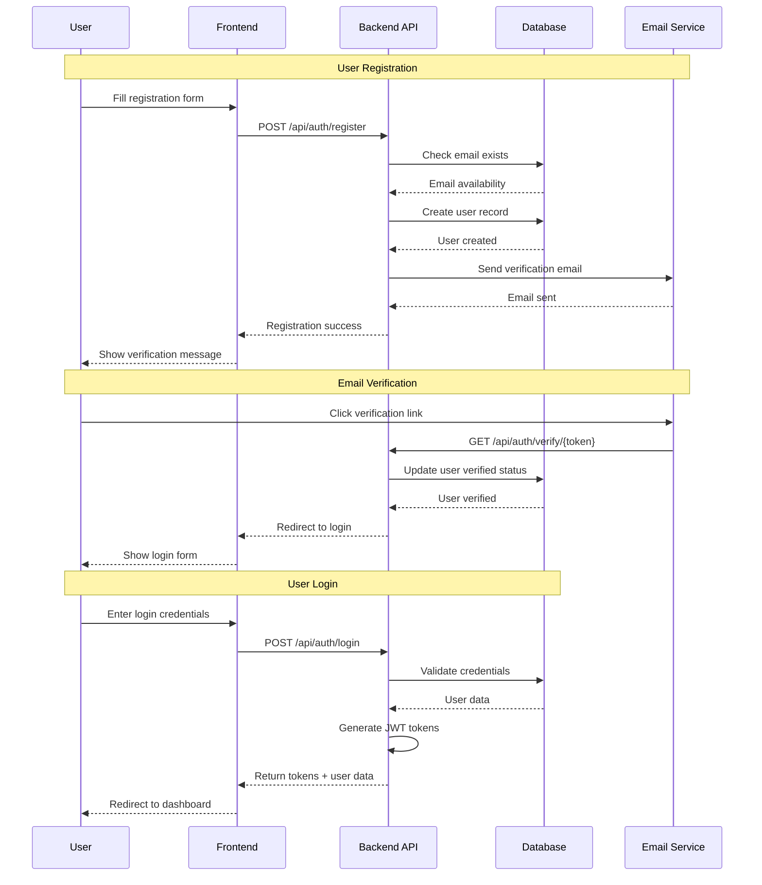
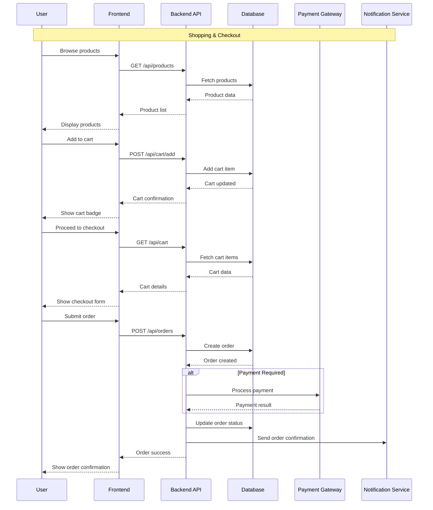
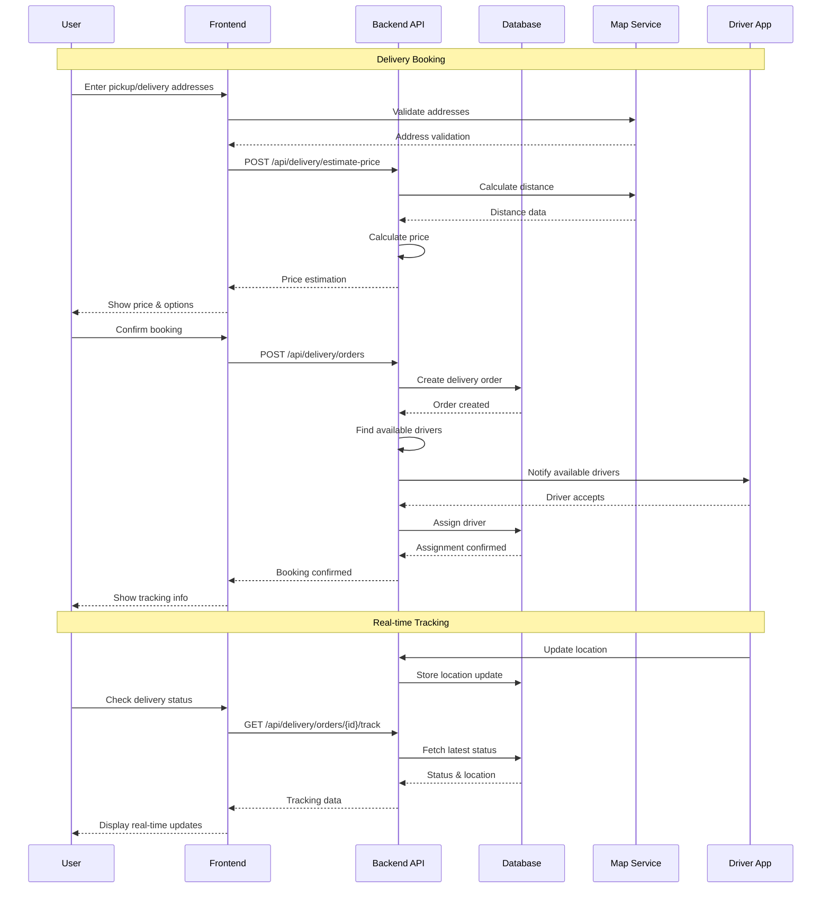
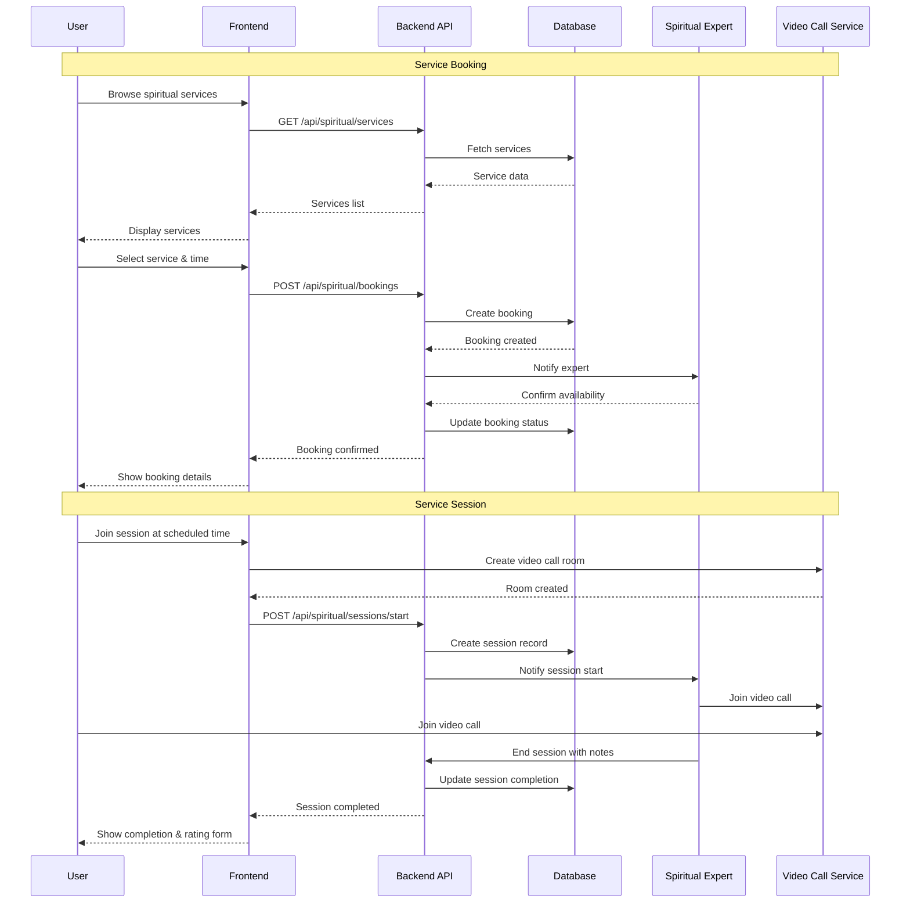
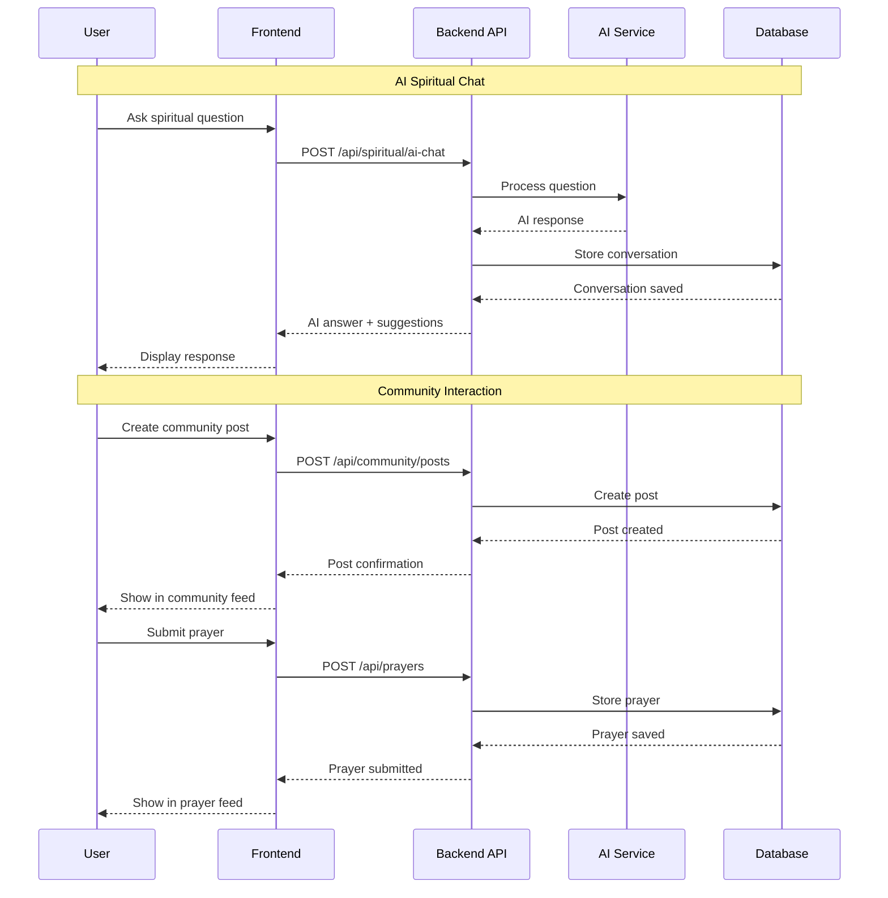

# Backend Data Flow & API Specification
## Website Thương Mại Điện Tử Đồ Cúng & Nghi Lễ Truyền Thống

> **Tài liệu này được tạo bởi Frontend Developer để đề xuất cấu trúc dữ liệu và API cho Backend Developer**

---

## 📋 1. TỔNG QUAN HỆ THỐNG

### Phạm vi chức năng chính:
- **E-commerce Core**: Sản phẩm, đơn hàng, giỏ hàng, thanh toán
- **VietDelivery**: Dịch vụ giao hàng tương tự ShopeeExpress/GrabExpress  
- **Spiritual Services**: Dịch vụ tâm linh (lễ online, phong thủy, AI chat)
- **Community**: Cộng đồng người dùng, Q&A, Prayer Feed
- **Calendar**: Lịch âm, sự kiện nghi lễ

### User Roles:
- **Customer**: Người dùng web/app
- **Staff**: Nhân viên xử lý đơn hàng
- **Manager**: Quản lý sản phẩm, dịch vụ
- **Admin**: Quản trị hệ thống
- **Driver**: Tài xế giao hàng (VietDelivery)
- **Spiritual Expert**: Chuyên gia tâm linh/phong thủy

---

## 📊 2. ENTITY RELATIONSHIP DIAGRAM (ERD)

```mermaid
erDiagram
    USER ||--o{ ORDER : places
    USER ||--o{ CART_ITEM : has
    USER ||--o{ PRAYER : submits
    USER ||--o{ COMMUNITY_POST : creates
    USER ||--o{ QA_QUESTION : asks
    USER ||--o{ DELIVERY_ORDER : books
    USER ||--o{ SPIRITUAL_BOOKING : books
    USER ||--o{ USER_REVIEW : writes

    ORDER ||--o{ ORDER_ITEM : contains
    ORDER ||--o{ PAYMENT : has
    ORDER ||--o{ ORDER_STATUS_HISTORY : tracks

    PRODUCT ||--o{ ORDER_ITEM : ordered_in
    PRODUCT ||--o{ CART_ITEM : added_to
    PRODUCT ||--o{ PRODUCT_REVIEW : reviewed
    PRODUCT }o--|| CATEGORY : belongs_to

    DELIVERY_ORDER ||--o{ DELIVERY_STATUS_HISTORY : tracks
    DELIVERY_ORDER ||--|| DRIVER_ASSIGNMENT : assigned_to
    DRIVER_ASSIGNMENT }o--|| DRIVER : assigned

    SPIRITUAL_BOOKING ||--|| SPIRITUAL_SERVICE : books
    SPIRITUAL_BOOKING ||--o{ SPIRITUAL_SESSION : contains

    COMMUNITY_POST ||--o{ COMMENT : has
    QA_QUESTION ||--o{ QA_ANSWER : has

    CALENDAR_EVENT ||--o{ USER_EVENT_REMINDER : reminds

    USER {
        int id PK
        string email UK
        string password_hash
        string full_name
        string phone
        text address
        enum role
        datetime created_at
        datetime updated_at
        boolean is_verified
        boolean is_active
    }

    CATEGORY {
        int id PK
        string name
        string slug UK
        text description
        string image_url
        boolean is_active
        int sort_order
    }

    PRODUCT {
        int id PK
        string name
        string slug UK
        text description
        decimal price
        decimal original_price
        int category_id FK
        string main_image_url
        json images
        boolean is_promoted
        boolean is_active
        int stock_quantity
        json spiritual_attributes
        datetime created_at
        datetime updated_at
    }

    CART_ITEM {
        int id PK
        int user_id FK
        int product_id FK
        int quantity
        datetime created_at
        datetime updated_at
    }

    ORDER {
        int id PK
        string order_number UK
        int user_id FK
        decimal total_amount
        decimal shipping_fee
        decimal discount_amount
        text shipping_address
        string shipping_phone
        enum status
        text notes
        datetime created_at
        datetime updated_at
    }

    ORDER_ITEM {
        int id PK
        int order_id FK
        int product_id FK
        int quantity
        decimal unit_price
        decimal total_price
    }

    PAYMENT {
        int id PK
        int order_id FK
        decimal amount
        enum payment_method
        enum status
        string transaction_id
        text payment_details
        datetime created_at
        datetime updated_at
    }

    ORDER_STATUS_HISTORY {
        int id PK
        int order_id FK
        enum status
        text note
        int updated_by_user_id FK
        datetime created_at
    }

    DELIVERY_ORDER {
        int id PK
        string tracking_number UK
        int user_id FK
        string pickup_address
        string delivery_address
        string pickup_phone
        string delivery_phone
        enum package_type
        decimal weight
        decimal estimated_price
        decimal final_price
        enum status
        datetime pickup_time
        datetime delivery_time
        text special_instructions
        datetime created_at
        datetime updated_at
    }

    DRIVER {
        int id PK
        string full_name
        string phone UK
        string license_number
        string vehicle_type
        decimal rating
        boolean is_active
        json location_coordinates
        datetime created_at
        datetime updated_at
    }

    DRIVER_ASSIGNMENT {
        int id PK
        int delivery_order_id FK
        int driver_id FK
        datetime assigned_at
        datetime completed_at
        enum status
    }

    DELIVERY_STATUS_HISTORY {
        int id PK
        int delivery_order_id FK
        enum status
        text note
        json location_coordinates
        datetime created_at
    }

    SPIRITUAL_SERVICE {
        int id PK
        string name
        string slug UK
        text description
        decimal price
        int duration_minutes
        enum service_type
        boolean is_active
        json service_attributes
    }

    SPIRITUAL_BOOKING {
        int id PK
        string booking_number UK
        int user_id FK
        int spiritual_service_id FK
        datetime scheduled_at
        decimal total_amount
        enum status
        text user_requirements
        datetime created_at
        datetime updated_at
    }

    SPIRITUAL_SESSION {
        int id PK
        int spiritual_booking_id FK
        datetime started_at
        datetime ended_at
        text session_notes
        json session_data
        enum status
    }

    PRAYER {
        int id PK
        int user_id FK
        string title
        text content
        enum prayer_type
        boolean is_anonymous
        boolean is_public
        datetime created_at
    }

    COMMUNITY_POST {
        int id PK
        int user_id FK
        string title
        text content
        enum post_type
        json attachments
        int likes_count
        int comments_count
        datetime created_at
        datetime updated_at
    }

    COMMENT {
        int id PK
        int post_id FK
        int user_id FK
        text content
        datetime created_at
        datetime updated_at
    }

    QA_QUESTION {
        int id PK
        int user_id FK
        string question
        enum category
        boolean is_answered
        datetime created_at
        datetime updated_at
    }

    QA_ANSWER {
        int id PK
        int question_id FK
        int expert_user_id FK
        text answer
        boolean is_ai_generated
        datetime created_at
        datetime updated_at
    }

    CALENDAR_EVENT {
        int id PK
        string title
        text description
        date lunar_date
        date solar_date
        enum event_type
        boolean is_national_holiday
        json event_attributes
    }

    USER_EVENT_REMINDER {
        int id PK
        int user_id FK
        int calendar_event_id FK
        boolean is_enabled
        datetime remind_at
        datetime created_at
    }

    PRODUCT_REVIEW {
        int id PK
        int product_id FK
        int user_id FK
        int rating
        text review_text
        json images
        datetime created_at
        datetime updated_at
    }

    USER_REVIEW {
        int id PK
        int reviewer_user_id FK
        int reviewed_user_id FK
        int delivery_order_id FK
        int rating
        text review_text
        enum review_type
        datetime created_at
    }
```



---

## 🔄 3. DTO/JSON SCHEMA SPECIFICATIONS

### 📄 Standard Pagination Schema

Tất cả API endpoints trả về danh sách sẽ sử dụng chuẩn pagination sau:

#### Query Parameters cho Pagination:
```
GET /api/endpoint?page=1&limit=10&sort=created_at&order=desc&search=keyword
```

**Parameters:**
- `page` (integer, optional): Số trang (default: 1)
- `limit` (integer, optional): Số items per page (default: 10, max: 100)
- `sort` (string, optional): Trường để sort (default: "created_at")
- `order` (enum, optional): "asc" hoặc "desc" (default: "desc")
- `search` (string, optional): Từ khóa tìm kiếm

#### Standard Pagination Response:
```json
{
  "success": true,
  "data": {
    "items": [...], // Array of data items
    "pagination": {
      "current_page": 1,
      "total_pages": 10,
      "total_items": 95,
      "items_per_page": 10,
      "has_next": true,
      "has_prev": false,
      "next_page": 2,
      "prev_page": null
    },
    "filters": {
      "search": "keyword",
      "sort": "created_at",
      "order": "desc",
      "applied_filters": {
        "category": "do_cung_le",
        "is_promoted": true
      }
    }
  },
  "meta": {
    "request_id": "req_123456",
    "response_time_ms": 150,
    "cached": false
  }
}
```

### 3.1 Authentication & User Management

#### POST /api/auth/register
```json
{
  "email": "user@example.com",
  "password": "password123",
  "full_name": "Nguyễn Văn A", 
  "phone": "0912345678",
  "address": "123 Đường ABC, Quận 1, TP.HCM"
}
```

#### POST /api/auth/login
```json
{
  "email": "user@example.com",
  "password": "password123"
}
```

#### Response /api/auth/login
```json
{
  "success": true,
  "data": {
    "user": {
      "id": 1,
      "email": "user@example.com",
      "full_name": "Nguyễn Văn A",
      "phone": "0912345678", 
      "role": "customer",
      "is_verified": true
    },
    "access_token": "jwt_token_here",
    "refresh_token": "refresh_token_here"
  }
}
```

### 3.2 E-commerce Core

#### GET /api/products?page=1&limit=10&category=do_cung_le&is_promoted=true&search=bộ%20đồ%20cúng
```json
{
  "success": true,
  "data": {
    "items": [
      {
        "id": 1,
        "name": "Bộ đồ cúng truyền thống",
        "slug": "bo-do-cung-truyen-thong",
        "description": "Bộ đồ cúng đầy đủ cho nghi lễ...",
        "price": 250000,
        "original_price": 300000,
        "main_image_url": "https://example.com/image.jpg",
        "images": ["image1.jpg", "image2.jpg"],
        "category": {
          "id": 1,
          "name": "Đồ cúng lễ",
          "slug": "do-cung-le"
        },
        "is_promoted": true,
        "stock_quantity": 50,
        "spiritual_attributes": {
          "blessing_type": "prosperity",
          "ritual_usage": "ancestor_worship"
        },
        "rating": 4.5,
        "review_count": 25
      }
    ],
    "pagination": {
      "current_page": 1,
      "total_pages": 10,
      "total_items": 95,
      "items_per_page": 10,
      "has_next": true,
      "has_prev": false,
      "next_page": 2,
      "prev_page": null
    },
    "filters": {
      "search": "bộ đồ cúng",
      "sort": "created_at",
      "order": "desc",
      "applied_filters": {
        "category": "do_cung_le",
        "is_promoted": true,
        "price_range": {
          "min": 100000,
          "max": 500000
        }
      }
    }
  },
  "meta": {
    "request_id": "req_products_123",
    "response_time_ms": 120,
    "cached": false
  }
}
```

#### POST /api/cart/add
```json
{
  "product_id": 1,
  "quantity": 2
}
```

#### GET /api/cart
```json
{
  "success": true,
  "data": {
    "items": [
      {
        "id": 1,
        "product": {
          "id": 1,
          "name": "Bộ đồ cúng truyền thống",
          "price": 250000,
          "main_image_url": "https://example.com/image.jpg"
        },
        "quantity": 2,
        "total_price": 500000
      }
    ],
    "summary": {
      "total_items": 2,
      "subtotal": 500000,
      "shipping_fee": 30000,
      "total_amount": 530000
    }
  }
}
```

#### POST /api/orders
```json
{
  "shipping_address": "123 Đường XYZ, Quận 1, TP.HCM",
  "shipping_phone": "0912345678",
  "payment_method": "cod",
  "notes": "Giao hàng vào buổi sáng"
}
```

#### GET /api/orders/{order_id}
```json
{
  "success": true,
  "data": {
    "id": 1,
    "order_number": "ORD-2024-001",
    "status": "processing",
    "total_amount": 530000,
    "shipping_fee": 30000,
    "shipping_address": "123 Đường XYZ, Quận 1, TP.HCM",
    "items": [
      {
        "product_name": "Bộ đồ cúng truyền thống",
        "quantity": 2,
        "unit_price": 250000,
        "total_price": 500000
      }
    ],
    "status_history": [
      {
        "status": "pending",
        "note": "Đơn hàng được tạo",
        "created_at": "2024-01-15T10:00:00Z"
      },
      {
        "status": "processing", 
        "note": "Đang chuẩn bị hàng",
        "created_at": "2024-01-15T11:00:00Z"
      }
    ],
    "created_at": "2024-01-15T10:00:00Z"
  }
}
```

### 3.3 VietDelivery Service

#### POST /api/delivery/estimate-price
```json
{
  "pickup_address": "123 Đường A, Quận 1, TP.HCM",
  "delivery_address": "456 Đường B, Quận 2, TP.HCM",
  "package_type": "small",
  "weight": 2.5
}
```

#### Response /api/delivery/estimate-price
```json
{
  "success": true,
  "data": {
    "estimated_price": 45000,
    "distance_km": 12.5,
    "estimated_duration_minutes": 35,
    "package_type": "small",
    "weight": 2.5
  }
}
```

#### POST /api/delivery/orders
```json
{
  "pickup_address": "123 Đường A, Quận 1, TP.HCM",
  "delivery_address": "456 Đường B, Quận 2, TP.HCM",
  "pickup_phone": "0912345678",
  "delivery_phone": "0987654321",
  "package_type": "small",
  "weight": 2.5,
  "pickup_time": "2024-01-15T14:00:00Z",
  "special_instructions": "Gọi trước khi đến"
}
```

#### GET /api/delivery/orders/{tracking_number}/track
```json
{
  "success": true,
  "data": {
    "tracking_number": "VD-2024-001",
    "status": "in_transit",
    "pickup_address": "123 Đường A, Quận 1, TP.HCM",
    "delivery_address": "456 Đường B, Quận 2, TP.HCM",
    "estimated_delivery": "2024-01-15T16:00:00Z",
    "driver": {
      "name": "Nguyễn Văn B",
      "phone": "0911223344",
      "vehicle_type": "motorcycle",
      "rating": 4.8
    },
    "current_location": {
      "lat": 10.7769,
      "lng": 106.7009,
      "address": "Gần ngã tư Nguyễn Huệ"
    },
    "status_history": [
      {
        "status": "pickup_confirmed",
        "note": "Đã lấy hàng thành công",
        "location": {
          "lat": 10.7769,
          "lng": 106.7009
        },
        "created_at": "2024-01-15T14:30:00Z"
      }
    ]
  }
}
```

### 3.4 Spiritual Services

#### GET /api/spiritual/services
```json
{
  "success": true,
  "data": [
    {
      "id": 1,
      "name": "Lễ cúng online",
      "slug": "le-cung-online",
      "description": "Dịch vụ lễ cúng trực tuyến...",
      "price": 500000,
      "duration_minutes": 60,
      "service_type": "virtual_ceremony",
      "service_attributes": {
        "ceremony_type": ["ancestor_worship", "prosperity_prayer"],
        "includes": ["incense_burning", "prayer_recitation", "blessing"]
      }
    },
    {
      "id": 2,
      "name": "Tư vấn phong thủy",
      "slug": "tu-van-phong-thuy",
      "description": "Tư vấn phong thủy với chuyên gia...",
      "price": 1000000,
      "duration_minutes": 90,
      "service_type": "consultation",
      "service_attributes": {
        "consultation_type": ["home", "office", "business"],
        "includes": ["analysis", "recommendations", "follow_up"]
      }
    }
  ]
}
```

#### POST /api/spiritual/bookings
```json
{
  "spiritual_service_id": 1,
  "scheduled_at": "2024-01-20T10:00:00Z",
  "user_requirements": "Cần cúng cho tổ tiên, gia đình 4 người"
}
```

#### POST /api/spiritual/ai-chat
```json
{
  "message": "Tôi muốn hỏi về cách bài trí bàn thờ tổ tiên",
  "conversation_id": "optional_conversation_id"
}
```

#### Response /api/spiritual/ai-chat
```json
{
  "success": true,
  "data": {
    "response": "Để bài trí bàn thờ tổ tiên đúng cách...",
    "conversation_id": "conv_123456",
    "suggestions": [
      "Hướng bàn thờ",
      "Vật phẩm cần thiết",
      "Thời gian thích hợp"
    ]
  }
}
```

### 3.5 Community & Prayer System

#### POST /api/prayers
```json
{
  "title": "Cầu nguyện cho gia đình",
  "content": "Cầu nguyện cho gia đình luôn bình an...",
  "prayer_type": "family_blessing",
  "is_anonymous": false,
  "is_public": true
}
```

#### GET /api/prayers/feed?page=1&limit=20&prayer_type=family_blessing
```json
{
  "success": true,
  "data": {
    "items": [
      {
        "id": 1,
        "title": "Cầu nguyện cho gia đình",
        "content": "Cầu nguyện cho gia đình luôn bình an...",
        "prayer_type": "family_blessing",
        "user": {
          "name": "Nguyễn Văn A",
          "is_anonymous": false
        },
        "likes_count": 15,
        "comments_count": 3,
        "created_at": "2024-01-15T10:00:00Z"
      }
    ],
    "pagination": {
      "current_page": 1,
      "total_pages": 5,
      "total_items": 89,
      "items_per_page": 20,
      "has_next": true,
      "has_prev": false,
      "next_page": 2,
      "prev_page": null
    },
    "filters": {
      "sort": "created_at",
      "order": "desc",
      "applied_filters": {
        "prayer_type": "family_blessing",
        "is_public": true
      }
    }
  }
}
```

#### POST /api/community/posts
```json
{
  "title": "Cách chọn ngày tốt để cúng",
  "content": "Mọi người có kinh nghiệm gì về chọn ngày...",
  "post_type": "question",
  "attachments": ["image1.jpg", "image2.jpg"]
}
```

#### GET /api/qa/questions?page=1&limit=15&category=feng_shui&is_answered=true
```json
{
  "success": true,
  "data": {
    "items": [
      {
        "id": 1,
        "question": "Cách bài trí bàn thờ gia tiên như thế nào?",
        "category": "feng_shui",
        "user": {
          "name": "Nguyễn Văn A"
        },
        "is_answered": true,
        "answer_count": 3,
        "view_count": 125,
        "like_count": 8,
        "answers": [
          {
            "id": 1,
            "answer": "Bàn thờ gia tiên nên được đặt...",
            "expert": {
              "name": "Thầy Minh An",
              "specialization": "Phong thủy"
            },
            "is_ai_generated": false,
            "like_count": 12,
            "created_at": "2024-01-15T11:00:00Z"
          }
        ],
        "created_at": "2024-01-15T10:00:00Z"
      }
    ],
    "pagination": {
      "current_page": 1,
      "total_pages": 8,
      "total_items": 112,
      "items_per_page": 15,
      "has_next": true,
      "has_prev": false,
      "next_page": 2,
      "prev_page": null
    },
    "filters": {
      "sort": "created_at",
      "order": "desc",
      "applied_filters": {
        "category": "feng_shui",
        "is_answered": true
      }
    }
  }
}
```

### 3.6 Calendar & Events

#### GET /api/calendar/events?page=1&limit=30&month=2024-02&event_type=traditional_holiday
```json
{
  "success": true,
  "data": {
    "items": [
      {
        "id": 1,
        "title": "Rằm tháng Giêng",
        "description": "Ngày rằm đầu năm, thời điểm quan trọng...",
        "lunar_date": "2024-01-15",
        "solar_date": "2024-02-24",
        "event_type": "traditional_holiday",
        "is_national_holiday": false,
        "importance_level": "high",
        "event_attributes": {
          "significance": "Spiritual cleansing",
          "recommended_activities": ["Temple visit", "Incense offering"],
          "avoid_activities": ["Heavy work", "Arguments"]
        },
        "reminder_count": 45
      }
    ],
    "pagination": {
      "current_page": 1,
      "total_pages": 3,
      "total_items": 67,
      "items_per_page": 30,
      "has_next": true,
      "has_prev": false,
      "next_page": 2,
      "prev_page": null
    },
    "filters": {
      "sort": "solar_date",
      "order": "asc",
      "applied_filters": {
        "month": "2024-02",
        "event_type": "traditional_holiday"
      }
    },
    "summary": {
      "total_events_this_month": 67,
      "national_holidays": 3,
      "traditional_events": 45,
      "important_dates": 12
    }
  }
}
```

---

## 🔄 4. SEQUENCE DIAGRAMS

### 4.1 User Registration & Login Flow


### 4.2 E-commerce Order Flow


### 4.3 VietDelivery Booking Flow


### 4.4 Spiritual Service Booking Flow


### 4.5 AI Chat & Community Interaction Flow


---

## 📋 5. API ENDPOINT SUMMARY

### 5.1 Authentication & User Management
- `POST /api/auth/register` - User registration
- `POST /api/auth/login` - User login
- `POST /api/auth/logout` - User logout
- `GET /api/auth/verify/{token}` - Email verification
- `POST /api/auth/forgot-password` - Password reset request
- `POST /api/auth/reset-password` - Password reset
- `GET /api/users/profile` - Get user profile
- `PUT /api/users/profile` - Update user profile

### 5.2 E-commerce Core
- `GET /api/categories` - Get product categories
- `GET /api/products` - Get products with pagination & filtering
- `GET /api/products/{id}` - Get product details
- `GET /api/products/{id}/reviews` - Get product reviews (paginated)
- `POST /api/cart/add` - Add item to cart
- `GET /api/cart` - Get cart contents
- `PUT /api/cart/update` - Update cart item
- `DELETE /api/cart/remove` - Remove cart item
- `POST /api/orders` - Create order
- `GET /api/orders` - Get user orders (paginated)
- `GET /api/orders/{id}` - Get order details

### 5.3 VietDelivery Service
- `POST /api/delivery/estimate-price` - Estimate delivery price
- `POST /api/delivery/orders` - Create delivery order
- `GET /api/delivery/orders` - Get user delivery orders (paginated)
- `GET /api/delivery/orders/{tracking_number}/track` - Track delivery
- `GET /api/delivery/orders/{id}/history` - Get delivery status history (paginated)
- `PUT /api/delivery/orders/{id}/status` - Update delivery status
- `POST /api/delivery/orders/{id}/rate` - Rate driver
- `GET /api/delivery/drivers` - Get available drivers (paginated)
- `GET /api/delivery/drivers/{id}/reviews` - Get driver reviews (paginated)

### 5.4 Spiritual Services
- `GET /api/spiritual/services` - Get spiritual services (paginated)
- `GET /api/spiritual/services/{id}/reviews` - Get service reviews (paginated)
- `POST /api/spiritual/bookings` - Book spiritual service
- `GET /api/spiritual/bookings` - Get user bookings (paginated)
- `GET /api/spiritual/bookings/{id}/sessions` - Get booking sessions (paginated)
- `POST /api/spiritual/ai-chat` - AI spiritual chat
- `GET /api/spiritual/ai-chat/history` - Get AI chat history (paginated)
- `POST /api/spiritual/sessions/start` - Start spiritual session
- `PUT /api/spiritual/sessions/{id}/end` - End spiritual session
- `GET /api/spiritual/experts` - Get spiritual experts (paginated)
- `GET /api/spiritual/experts/{id}/reviews` - Get expert reviews (paginated)

### 5.5 Community & Prayers
- `POST /api/prayers` - Submit prayer
- `GET /api/prayers/feed` - Get prayer feed (paginated)
- `GET /api/prayers/user/{id}` - Get user prayers (paginated)
- `POST /api/community/posts` - Create community post
- `GET /api/community/posts` - Get community posts (paginated)
- `GET /api/community/posts/{id}/comments` - Get post comments (paginated)
- `POST /api/community/posts/{id}/comments` - Add comment
- `GET /api/community/users/{id}/posts` - Get user posts (paginated)
- `POST /api/qa/questions` - Submit Q&A question
- `GET /api/qa/questions` - Get Q&A questions (paginated)
- `GET /api/qa/questions/{id}/answers` - Get question answers (paginated)
- `POST /api/qa/answers` - Submit answer
- `GET /api/qa/users/{id}/questions` - Get user questions (paginated)
- `GET /api/qa/users/{id}/answers` - Get user answers (paginated)

### 5.6 Calendar & Events
- `GET /api/calendar/events` - Get calendar events (paginated)
- `GET /api/calendar/events/today` - Get today's events
- `GET /api/calendar/events/upcoming` - Get upcoming important events (paginated)
- `POST /api/calendar/reminders` - Set event reminder
- `GET /api/calendar/reminders` - Get user reminders (paginated)
- `GET /api/calendar/lunar-dates` - Get lunar calendar data
- `GET /api/calendar/holidays` - Get national holidays (paginated)

### 5.7 Admin & Management APIs (với advanced pagination)
- `GET /api/admin/users` - Quản lý users (paginated với advanced filters)
- `GET /api/admin/orders` - Quản lý orders (paginated với advanced filters) 
- `GET /api/admin/products` - Quản lý products (paginated với advanced filters)
- `GET /api/admin/delivery/orders` - Quản lý delivery orders (paginated)
- `GET /api/admin/spiritual/bookings` - Quản lý spiritual bookings (paginated)
- `GET /api/admin/community/posts` - Quản lý community posts (paginated)
- `GET /api/admin/qa/questions` - Quản lý Q&A questions (paginated)
- `GET /api/admin/analytics/dashboard` - Dashboard analytics data
- `GET /api/admin/reports/sales` - Sales reports (paginated với date ranges)
- `GET /api/admin/logs/system` - System logs (paginated với filtering)

---

## 📊 6. ADVANCED PAGINATION FEATURES

### 6.1 Cursor-based Pagination (cho real-time feeds)
Cho Prayer Feed, Community Feed, Chat History - sử dụng cursor thay vì page number:

```
GET /api/prayers/feed?cursor=eyJ0aW1lc3RhbXAiOjE2NDU4NzIwMDB9&limit=20
```

**Response:**
```json
{
  "success": true,
  "data": {
    "items": [...],
    "pagination": {
      "next_cursor": "eyJ0aW1lc3RhbXAiOjE2NDU4NzE4MDB9",
      "prev_cursor": "eyJ0aW1lc3RhbXAiOjE2NDU4NzIyMDB9",
      "has_next": true,
      "has_prev": true,
      "limit": 20
    }
  }
}
```

### 6.2 Search & Filter Pagination
Cho advanced search với nhiều filters:

```
GET /api/products?page=1&limit=12&category=do_cung_le&price_min=100000&price_max=500000&is_promoted=true&sort=popularity&order=desc&search=bộ%20đồ%20cúng
```

**Response bao gồm filter metadata:**
```json
{
  "success": true,
  "data": {
    "items": [...],
    "pagination": {...},
    "filters": {
      "available_categories": [
        {"id": 1, "name": "Đồ cúng lễ", "count": 45},
        {"id": 2, "name": "Hương trầm", "count": 32}
      ],
      "price_range": {
        "min": 50000,
        "max": 2000000
      },
      "sort_options": ["popularity", "price", "rating", "created_at"],
      "total_results": 95
    }
  }
}
```

### 6.3 Infinite Scroll Support
Cho mobile apps và infinite scroll:

```
GET /api/community/posts?last_id=123&limit=10&sort=created_at&order=desc
```

**Response:**
```json
{
  "success": true,
  "data": {
    "items": [...],
    "pagination": {
      "last_id": 113,
      "has_more": true,
      "limit": 10,
      "load_more_url": "/api/community/posts?last_id=113&limit=10&sort=created_at&order=desc"
    }
  }
}
```

### 6.4 Bulk Operations với Pagination
Cho admin operations:

```
POST /api/admin/products/bulk-update
{
  "filters": {
    "category": "do_cung_le",
    "is_active": true
  },
  "updates": {
    "is_promoted": true
  },
  "pagination": {
    "batch_size": 100,
    "process_all": true
  }
}
```

**Response:**
```json
{
  "success": true,
  "data": {
    "job_id": "bulk_update_12345",
    "total_items": 450,
    "batch_size": 100,
    "estimated_time_minutes": 5,
    "status_url": "/api/admin/jobs/bulk_update_12345/status"
  }
}
```

---

## 🔧 7. TECHNICAL CONSIDERATIONS

### 6.1 Authentication & Security
- JWT-based authentication với refresh tokens
- Role-based access control (RBAC)
- Password hashing với bcrypt
- Rate limiting cho API calls
- Input validation và sanitization

### 6.2 Real-time Features
- WebSocket connection cho:
  - Live delivery tracking
  - Real-time chat (AI & support)
  - Prayer feed updates
  - Order status notifications

### 6.3 File Upload & Storage
- Profile images, product images
- Community post attachments
- Spiritual session recordings
- Cloud storage integration (AWS S3/CloudFlare R2)

### 6.4 External Integrations
- **Payment Gateways**: VNPay, MoMo, ZaloPay
- **Map Services**: Google Maps API cho delivery
- **AI Services**: OpenAI/local LLM cho spiritual chat
- **Video Call**: Zoom/Agora SDK cho spiritual sessions
- **SMS/Email**: Notification services

### 7.5 Performance & Scalability
- **Database indexing strategies**:
  - Composite indexes cho pagination (created_at + id)
  - Text search indexes cho search functionality
  - Partial indexes cho filtered queries
- **Caching layer (Redis)**:
  - Cache frequently accessed pages (page 1-3)
  - Cache search results với TTL
  - Cache filter metadata
- **CDN cho static assets**
- **API response optimization**:
  - Response compression
  - Field selection (?fields=id,name,price)
  - Lazy loading cho related data
- **Horizontal scaling considerations**
- **Pagination Performance Tips**:
  - Sử dụng cursor-based cho large datasets
  - Limit max page size (100 items)
  - Cache total count cho expensive queries
  - Use estimated counts cho very large datasets

---

## 📝 8. NOTES FOR BACKEND TEAM

### 8.1 Priority Features (MVP)
1. **Core Authentication & User Management**
2. **Basic E-commerce với pagination** (products, cart, orders)
3. **Simple Delivery Booking** (no real-time tracking)
4. **Static Calendar Events với pagination**
5. **Basic Community Posts với pagination**
6. **Standard pagination implementation** cho tất cả list APIs

### 8.2 Phase 2 Features
1. **Real-time Delivery Tracking**
2. **AI Spiritual Chat Integration với chat history pagination**
3. **Video Call Spiritual Sessions**
4. **Advanced Prayer System với cursor-based pagination**
5. **Mobile App API Optimization với infinite scroll**
6. **Advanced search & filtering với faceted search**
7. **Cursor-based pagination cho real-time feeds**

### 8.3 Cultural Considerations
- **Lunar Calendar Integration**: Cần thư viện tính toán lịch âm chính xác
- **Vietnamese Text Processing**: Support Unicode, diacritics cho search
- **Time Zone**: ICT (UTC+7) default
- **Currency**: VND formatting
- **Address Format**: Vietnamese address standards
- **Search Optimization**: Vietnamese text search với diacritics support

### 8.4 Data Seeding Requirements
- **Categories**: Đồ cúng lễ, Hương trầm, Phật phẩm, etc. (minimum 20 items for pagination testing)
- **Products**: Sample traditional items với spiritual attributes (minimum 100 products)
- **Calendar Events**: Major Vietnamese holidays and lunar events (full year data)
- **Spiritual Services**: Template services for different rituals (minimum 20 services)
- **Sample Users**: Different roles for testing (minimum 50 users)
- **Community Content**: Sample posts, prayers, Q&A (minimum 200 items each)
- **Reviews & Ratings**: Sample reviews for products/services (minimum 500 reviews)

### 8.5 Pagination Implementation Guidelines
1. **Always validate page & limit parameters**
2. **Implement consistent error handling** cho invalid pagination
3. **Use database LIMIT/OFFSET efficiently**
4. **Cache expensive count queries**
5. **Provide helpful pagination metadata**
6. **Support multiple pagination styles** (offset-based, cursor-based)
7. **Implement proper indexing** cho pagination performance
8. **Consider using estimated counts** cho very large datasets (> 100k records)

---

> **Tài liệu này được tạo dựa trên Frontend đã hoàn thiện. Backend team có thể sử dụng làm reference và điều chỉnh theo kiến trúc hệ thống cụ thể.**