# Workflow & Business Logic Documentation

## Overview
This document outlines the core business workflows and logic for the multi-page role-based POS system. Each workflow includes step-by-step processes, role requirements, and system interactions.

## Core Business Workflows

### 1. Staff Shift Management

#### Opening a Shift

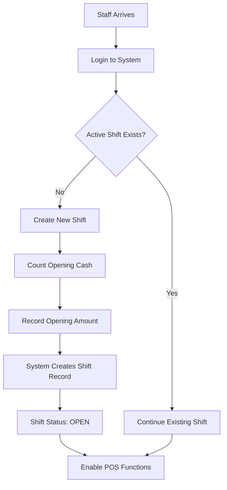

**Business Rules:**
- Staff can only have one active shift at a time
- Opening cash must be recorded and validated
- Shift start time is automatically recorded
- POS functions are disabled until shift is opened

**Input/Output:**
- **Input**: Staff credentials, opening cash amount, optional notes
- **Output**: Shift ID, start timestamp, opening cash balance
- **Role**: Staff, Manager

#### Closing a Shift

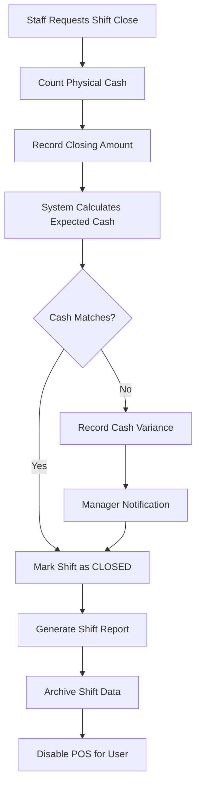

**Business Rules:**
- All pending orders must be completed or voided
- Cash variance over threshold requires manager approval
- Shift end time is automatically recorded
- System generates shift summary report

**Expected Cash Calculation:**
```
Expected Cash = Opening Cash + Cash Sales - Cash Refunds + Tips
```

### 2. POS Transaction Flow

#### Creating a Sale

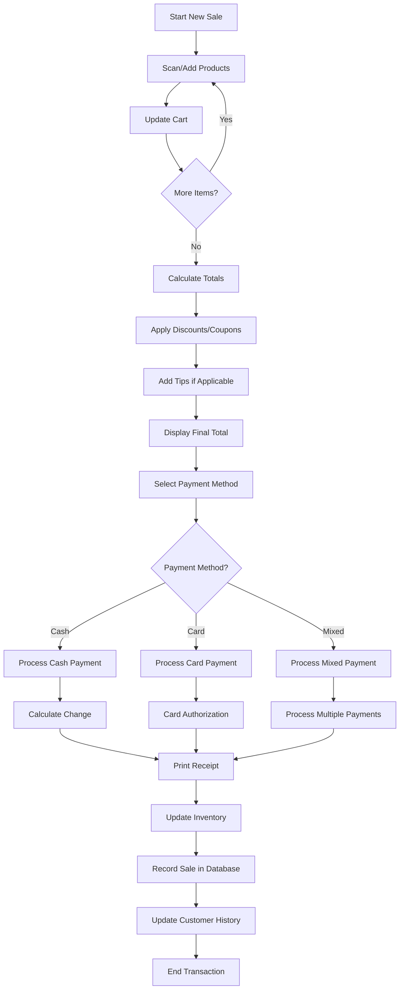

**Business Rules:**
- Minimum transaction amount: $0.01
- Maximum transaction amount: $9,999.99
- Tax calculation based on store settings
- Inventory deduction happens after payment confirmation
- Receipt must be offered for all transactions

**Inventory Update Logic:**
```
For each item in sale:
  IF product.track_inventory = true:
    inventory.quantity -= item.quantity
    inventory.reserved_quantity -= item.quantity (if previously reserved)
    
  IF inventory.quantity <= inventory.min_stock:
    CREATE low_stock_notification
```

#### Barcode Scanning Workflow

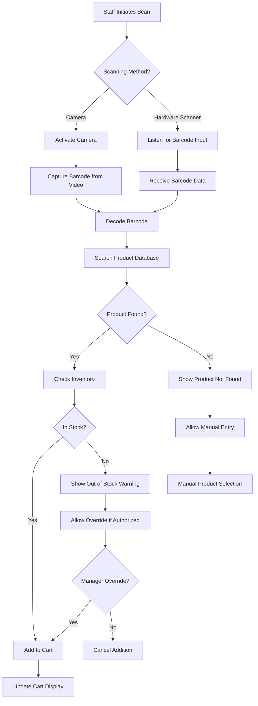

### 3. Order Management Workflow

#### Order Processing for Staff

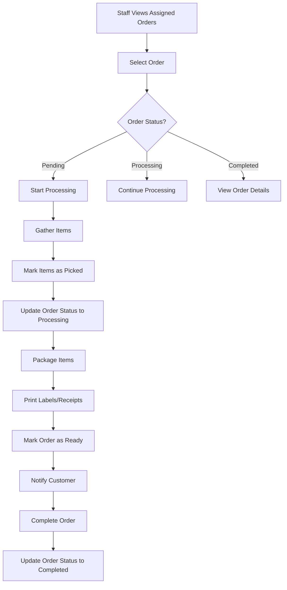

#### Order Assignment (Manager)

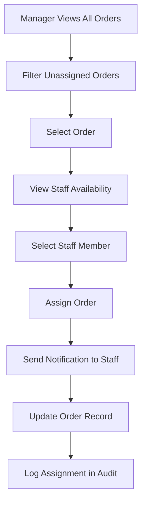

**Assignment Logic:**
- Consider staff workload and current assignments
- Match order requirements with staff skills
- Priority orders get assigned first
- Staff availability and shift status

### 4. Inventory Management

#### Stock Level Monitoring

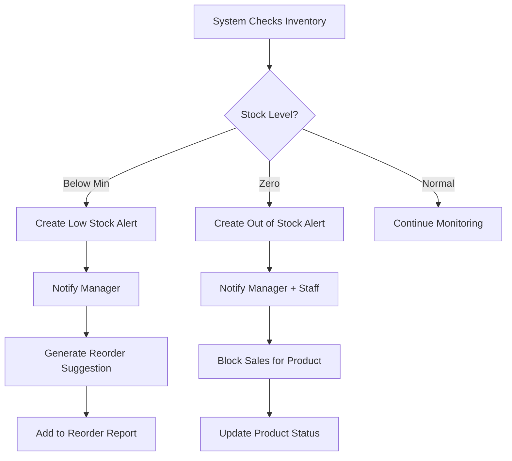

**Stock Check Triggers:**
- After each sale transaction
- During inventory adjustments
- Scheduled daily checks (automated)
- Manual checks by staff

#### Inventory Adjustment Process

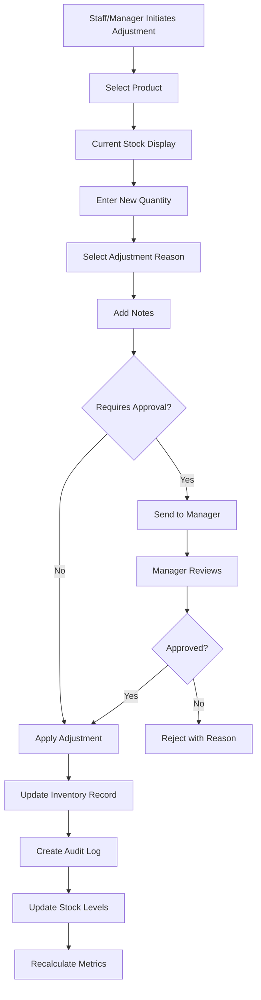

**Approval Required When:**
- Adjustment amount exceeds threshold ($500)
- Reason is "Loss" or "Damage"
- Staff member (non-manager) making adjustment
- High-value product adjustment

### 5. Task Management Workflow

#### Task Creation (Manager)

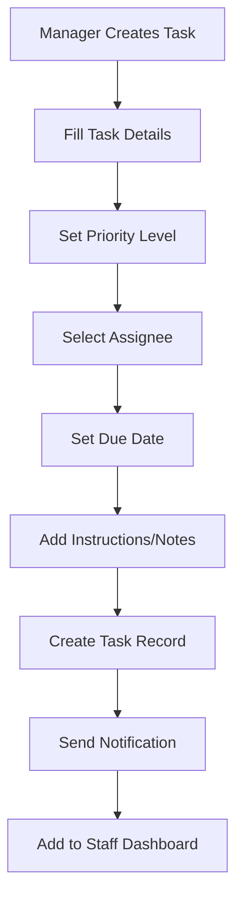

#### Task Execution (Staff)

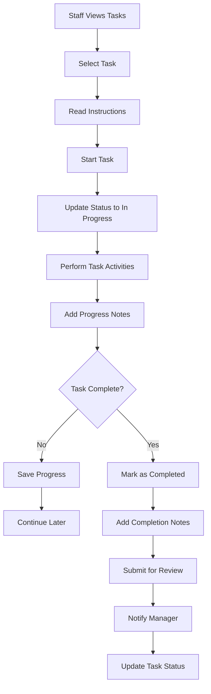

### 6. Customer Management

#### Customer Registration

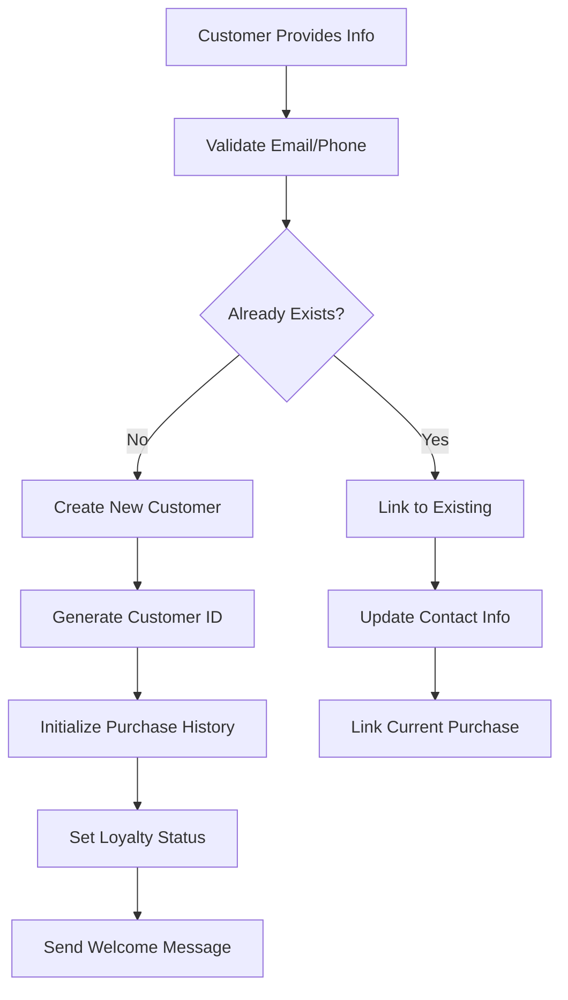

#### Purchase History Tracking

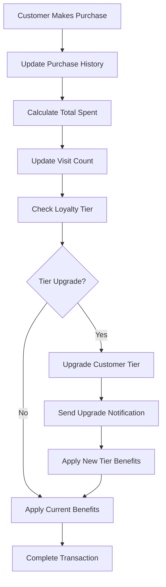

### 7. Reporting & Analytics

#### Daily Sales Report Generation

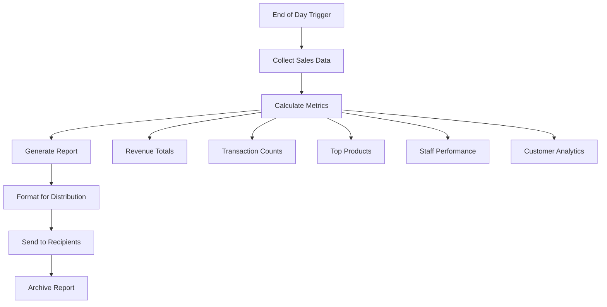

**Report Metrics Calculation:**
```
Daily Revenue = SUM(order.total_amount) WHERE DATE(created_at) = TODAY
Average Transaction = Daily Revenue / Transaction Count
Items Sold = SUM(order_items.quantity)
Top Staff = MAX(SUM(order.total_amount) GROUP BY staff_id)
```

### 8. Security & Audit Workflows

#### Permission Checking

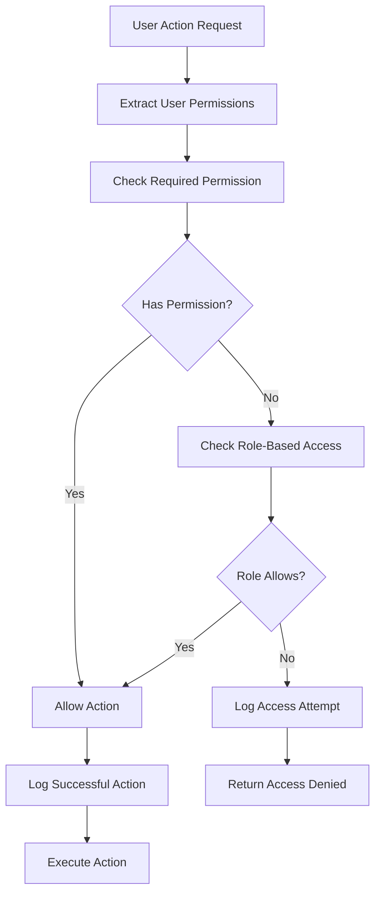

#### Audit Log Creation

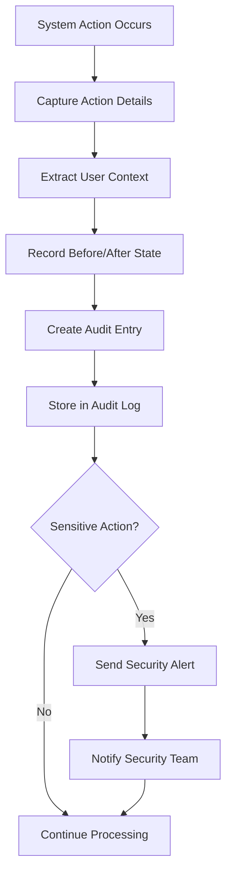

**Audited Actions:**
- User login/logout
- Permission changes
- Order modifications
- Inventory adjustments
- Price changes
- Staff management actions
- System configuration changes

## Business Rules Summary

### General Rules
1. **Single Store Context**: Users operate within one store at a time
2. **Shift Requirement**: POS functions require active shift
3. **Permission-Based Access**: All actions validated against user permissions
4. **Audit Trail**: All significant actions logged for compliance
5. **Data Retention**: Customer data retained per GDPR requirements

### Financial Rules
1. **Cash Handling**: All cash transactions tracked and reconciled
2. **Tax Calculation**: Applied per store configuration
3. **Refund Policy**: Refunds require manager approval over threshold
4. **Discount Limits**: Staff discount limits enforced
5. **Payment Processing**: Card payments require external gateway confirmation

### Inventory Rules
1. **Stock Reservation**: Items reserved during cart creation
2. **Negative Stock**: Controlled by product configuration
3. **Auto-Reorder**: Triggered when stock falls below minimum
4. **Cycle Counting**: Regular inventory verification required
5. **Adjustment Approval**: Large adjustments require manager approval

### Security Rules  
1. **Password Policy**: Strong passwords enforced
2. **Session Management**: Automatic timeout after inactivity
3. **Access Logging**: All access attempts logged
4. **Data Encryption**: Sensitive data encrypted at rest and in transit
5. **Backup Requirements**: Regular automated backups maintained