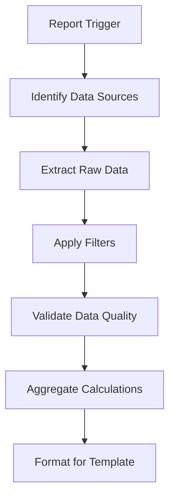

# Notifications and Reports Documentation

## Overview
This document outlines the notification system and reporting capabilities for the multi-page role-based POS system. It covers notification types, delivery methods, report generation, and scheduling.

## Notification System

### Notification Types

#### 1. Order Notifications
**Purpose**: Keep staff and managers informed about order status changes

| Event | Recipients | Channels | Template |
|-------|------------|----------|----------|
| New Order Created | Assigned Staff | In-App, Email | `new_order_assigned` |
| Order Status Updated | Customer, Manager | In-App, SMS, Email | `order_status_change` |
| Order Cancelled | Staff, Manager, Customer | In-App, Email | `order_cancelled` |
| Payment Failed | Manager | In-App, Email | `payment_failed` |
| Refund Processed | Customer, Manager | Email | `refund_processed` |

**Sample Payload:**
```json
{
    "type": "order_status_change",
    "recipient_id": "user-123",
    "data": {
        "order_id": "order-456",
        "order_number": "ORD-2024-001",
        "old_status": "pending",
        "new_status": "completed",
        "customer_name": "John Doe",
        "total_amount": 31.58
    },
    "channels": ["in_app", "email"],
    "priority": "normal"
}
```

#### 2. Inventory Notifications
**Purpose**: Alert staff about stock levels and inventory issues

| Event | Recipients | Channels | Template |
|-------|------------|----------|----------|
| Low Stock Alert | Manager, Inventory Staff | In-App, Email | `low_stock_alert` |
| Out of Stock | All Staff, Manager | In-App, Push | `out_of_stock` |
| Stock Adjustment | Manager | In-App | `stock_adjusted` |
| Reorder Suggestion | Manager | Email | `reorder_suggestion` |
| Inventory Count Due | Inventory Staff | In-App, Email | `inventory_count_due` |

**Sample Low Stock Notification:**
```json
{
    "type": "low_stock_alert",
    "recipient_role": "manager",
    "data": {
        "product_id": "product-123",
        "product_name": "Coffee Mug",
        "current_stock": 5,
        "min_stock": 10,
        "suggested_reorder": 50,
        "store_id": "store-1"
    },
    "channels": ["in_app", "email"],
    "priority": "high"
}
```

#### 3. Staff Management Notifications
**Purpose**: Communicate staff-related events and tasks

| Event | Recipients | Channels | Template |
|-------|------------|----------|----------|
| Task Assigned | Assigned Staff | In-App, Push | `task_assigned` |
| Task Due Soon | Assigned Staff | In-App, Push | `task_due_reminder` |
| Task Overdue | Staff, Manager | In-App, Email | `task_overdue` |
| Shift Reminder | Staff | Push, SMS | `shift_reminder` |
| Schedule Change | Affected Staff | In-App, SMS | `schedule_change` |
| Performance Review Due | Staff, Manager | Email | `review_due` |

#### 4. System Notifications
**Purpose**: Alert users about system events and maintenance

| Event | Recipients | Channels | Template |
|-------|------------|----------|----------|
| System Maintenance | All Users | In-App, Email | `maintenance_notice` |
| Security Alert | Admins | In-App, Email, SMS | `security_alert` |
| Backup Failed | Admins | Email, SMS | `backup_failed` |
| Integration Error | Manager | In-App, Email | `integration_error` |
| License Expiring | Admins | Email | `license_expiring` |

### Notification Channels

#### In-App Notifications
- **Real-time delivery** via WebSocket
- **Persistent storage** in database
- **Read/unread status** tracking
- **Action buttons** for quick responses

```json
{
    "id": "notif-123",
    "user_id": "user-456",
    "type": "task_assigned",
    "title": "New Task Assigned",
    "message": "You have been assigned: Restock Coffee Mugs",
    "data": {
        "task_id": "task-789",
        "due_date": "2024-01-21T16:00:00Z"
    },
    "actions": [
        {
            "label": "View Task",
            "action": "navigate",
            "url": "/tasks/task-789"
        },
        {
            "label": "Mark as Read",
            "action": "mark_read"
        }
    ],
    "is_read": false,
    "created_at": "2024-01-20T10:30:00Z"
}
```

#### Email Notifications
- **HTML templates** with branded design
- **Personalization** with user/store data
- **Unsubscribe links** for non-critical notifications
- **Delivery tracking** and bounce handling

#### SMS Notifications
- **Critical alerts only** (security, emergencies)
- **Character limit optimization**
- **Opt-in required** for compliance
- **Carrier-specific formatting**

#### Push Notifications
- **Mobile app integration**
- **Browser push** for web users
- **Rich notifications** with images/actions
- **Time-zone aware** delivery

### Notification Preferences

#### User Preference Management
```json
{
    "user_id": "user-123",
    "preferences": {
        "order_updates": {
            "in_app": true,
            "email": true,
            "sms": false,
            "push": true
        },
        "inventory_alerts": {
            "in_app": true,
            "email": false,
            "sms": false,
            "push": false
        },
        "task_notifications": {
            "in_app": true,
            "email": true,
            "sms": false,
            "push": true
        },
        "system_announcements": {
            "in_app": true,
            "email": true,
            "sms": false,
            "push": false
        }
    },
    "quiet_hours": {
        "enabled": true,
        "start_time": "20:00",
        "end_time": "08:00",
        "timezone": "America/New_York"
    }
}
```

#### Global Notification Settings
- **Emergency override** bypasses user preferences
- **Store-level defaults** for new users
- **Compliance requirements** cannot be disabled
- **Frequency limits** to prevent spam

## Reporting System

### Report Categories

#### 1. Sales Reports

##### Daily Sales Summary
**Purpose**: Overview of daily sales performance
**Frequency**: Daily (automated)
**Recipients**: Manager, Owner
**Format**: PDF, CSV

**Content:**
- Total revenue and transaction count
- Payment method breakdown  
- Top-selling products
- Hourly sales trends
- Staff performance summary
- Tax and discount totals

**Sample Data Structure:**
```json
{
    "report_date": "2024-01-20",
    "store_id": "store-1",
    "summary": {
        "total_revenue": 2450.75,
        "total_transactions": 87,
        "average_transaction": 28.17,
        "items_sold": 156
    },
    "payment_methods": {
        "cash": 980.25,
        "card": 1350.50,
        "digital": 120.00
    },
    "top_products": [
        {
            "product_name": "Coffee Mug",
            "quantity_sold": 25,
            "revenue": 324.75
        }
    ],
    "hourly_sales": [
        {"hour": "09:00", "revenue": 150.25, "transactions": 8},
        {"hour": "10:00", "revenue": 225.50, "transactions": 12}
    ]
}
```

##### Weekly Sales Analysis
**Purpose**: Weekly trends and comparisons
**Frequency**: Weekly (automated)
**Recipients**: Manager, Regional Manager
**Format**: PDF with charts

##### Monthly Financial Report
**Purpose**: Comprehensive monthly financial overview
**Frequency**: Monthly (automated)
**Recipients**: Manager, Accounting, Owner
**Format**: Excel with multiple sheets

#### 2. Inventory Reports

##### Stock Level Report
**Purpose**: Current inventory status across all products
**Frequency**: Daily (automated), On-demand
**Recipients**: Manager, Inventory Staff
**Format**: CSV, PDF

**Content:**
- Current stock levels
- Products below minimum stock
- Out-of-stock items
- Reorder suggestions
- Stock value calculations
- Movement history

##### Inventory Movement Report
**Purpose**: Track product movement over time period
**Frequency**: Weekly, Monthly
**Recipients**: Manager, Inventory Staff
**Format**: Excel with pivot tables

##### Stock Adjustment Report
**Purpose**: All inventory adjustments and reasons
**Frequency**: On-demand
**Recipients**: Manager, Auditor
**Format**: PDF with audit trail

#### 3. Staff Reports

##### Staff Performance Report
**Purpose**: Individual and team performance metrics
**Frequency**: Weekly, Monthly
**Recipients**: Manager, HR
**Format**: PDF with charts

**Content:**
- Sales performance by staff member
- Transaction counts and averages
- Customer service metrics
- Task completion rates
- Attendance and punctuality
- Goal achievement status

##### Payroll Summary
**Purpose**: Hours worked and commission calculations
**Frequency**: Bi-weekly, Monthly
**Recipients**: Manager, Payroll Department
**Format**: CSV for payroll system import

##### Time and Attendance
**Purpose**: Track working hours and shift patterns
**Frequency**: Weekly
**Recipients**: Manager, HR
**Format**: Excel spreadsheet

#### 4. Customer Reports

##### Customer Analysis Report
**Purpose**: Customer behavior and loyalty insights
**Frequency**: Monthly
**Recipients**: Manager, Marketing
**Format**: PDF with visualizations

**Content:**
- New vs returning customers
- Customer lifetime value
- Purchase frequency analysis
- Popular product combinations
- Geographic distribution
- Loyalty program effectiveness

##### Customer Contact List
**Purpose**: Marketing and communication purposes
**Frequency**: On-demand
**Recipients**: Manager, Marketing
**Format**: CSV with contact preferences

### Scheduled Reports

#### Daily Reports (Automated)
- **Time**: 11:59 PM store local time
- **Delivery**: Email to configured recipients
- **Retention**: 90 days online, archived annually

#### Weekly Reports (Automated)
- **Time**: Monday 6:00 AM store local time
- **Delivery**: Email with PDF attachment
- **Retention**: 1 year online, archived after 3 years

#### Monthly Reports (Automated)
- **Time**: 1st of month, 6:00 AM store local time
- **Delivery**: Email with Excel attachment
- **Retention**: 3 years online, archived after 7 years

#### Custom Scheduled Reports
```json
{
    "report_id": "custom-weekly-inventory",
    "name": "Weekly Inventory Status",
    "type": "inventory_status",
    "schedule": {
        "frequency": "weekly",
        "day_of_week": "friday",
        "time": "16:00",
        "timezone": "America/New_York"
    },
    "recipients": [
        "manager@store.com",
        "inventory@store.com"
    ],
    "format": "pdf",
    "filters": {
        "low_stock_only": true,
        "categories": ["electronics", "accessories"]
    },
    "active": true
}
```

### Report Generation Process

#### 1. Data Collection


#### 2. Template Processing
- **Dynamic content** based on data
- **Chart generation** with responsive design
- **Conditional sections** based on data availability
- **Localization** for multi-language support

#### 3. Delivery Methods
- **Email attachment** for scheduled reports
- **Download link** for large reports
- **Dashboard integration** for real-time viewing
- **API access** for system integration

### Report Templates

#### Email Template Structure
```html
<!DOCTYPE html>
<html>
<head>
    <title>{{report_title}} - {{store_name}}</title>
    <style>/* Branded CSS styles */</style>
</head>
<body>
    <header>
        
        <h1>{{report_title}}</h1>
        <p>{{report_period}}</p>
    </header>
    
    <main>
        <section class="summary">
            <h2>Executive Summary</h2>
            <!-- Key metrics -->
        </section>
        
        <section class="details">
            <h2>Detailed Analysis</h2>
            <!-- Charts and tables -->
        </section>
    </main>
    
    <footer>
        <p>Generated on {{generation_time}}</p>
        <p>{{store_address}} | {{store_phone}}</p>
    </footer>
</body>
</html>
```

### Report Access Control

#### Permission-Based Access
| Report Type | Required Permission | Additional Restrictions |
|-------------|-------------------|------------------------|
| Sales Reports | `view_analytics` | Store-specific data only |
| Staff Reports | `manage_staff` | Manager role required |
| Customer Reports | `view_customers` | GDPR compliance checks |
| Inventory Reports | `view_inventory` | Store-specific data only |

#### Data Privacy Compliance
- **Personal data anonymization** in shared reports
- **Access logging** for audit compliance
- **Data retention policies** enforced automatically
- **Export restrictions** for sensitive data

### Integration Points

#### External Systems
- **Accounting software** (QuickBooks, Xero)
- **Email marketing** (Mailchimp, Constant Contact)
- **Analytics platforms** (Google Analytics, Mixpanel)
- **Business intelligence** tools (Tableau, Power BI)

#### API Endpoints for Reports
```
GET /api/reports/generate
POST /api/reports/schedule
PUT /api/reports/schedule/{id}
DELETE /api/reports/schedule/{id}
GET /api/reports/download/{id}
```