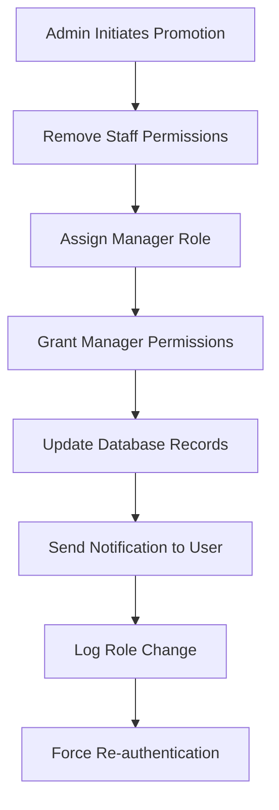
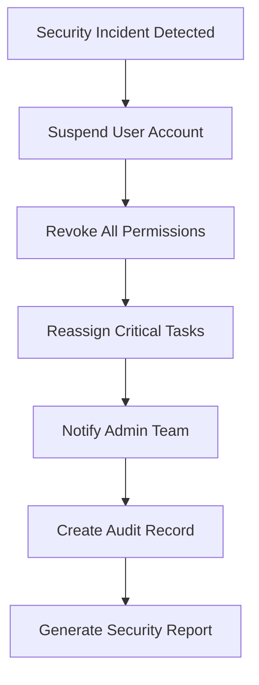

# Permissions and Roles Documentation

## Overview
This document defines the role-based access control (RBAC) system for the multi-page POS application. It outlines roles, permissions, access matrix, and implementation guidelines.

## Role Hierarchy

### 1. Staff Role
**Description**: Front-line employees who handle day-to-day operations
**Scope**: Limited to own store, own data, and assigned tasks

**Core Responsibilities:**
- Process customer transactions at POS
- Manage assigned orders
- Update inventory with approval
- Complete assigned tasks
- View own performance metrics

### 2. Manager Role  
**Description**: Store managers with operational oversight
**Scope**: Full access to assigned store(s) and staff management

**Core Responsibilities:**
- Manage store operations
- Supervise staff members
- Access all store analytics
- Approve inventory adjustments
- Assign tasks and orders
- Generate reports

### 3. Admin Role
**Description**: System administrators with platform-wide access
**Scope**: Multi-store access, system configuration, user management

**Core Responsibilities:**
- Manage multiple stores
- Configure system settings
- Create/manage manager accounts
- Access platform-wide analytics
- Handle integrations
- Security management

## Permission System

### Permission Categories

#### 1. Authentication & User Management
| Permission | Description | Staff | Manager | Admin |
|------------|-------------|--------|---------|-------|
| `auth.login` | Can login to system | ✅ | ✅ | ✅ |
| `auth.change_password` | Can change own password | ✅ | ✅ | ✅ |
| `users.view_own` | View own profile | ✅ | ✅ | ✅ |
| `users.edit_own` | Edit own profile | ✅ | ✅ | ✅ |
| `users.view_all` | View all users in store | ❌ | ✅ | ✅ |
| `users.create` | Create new users | ❌ | ✅ | ✅ |
| `users.edit_all` | Edit other users | ❌ | ✅ | ✅ |
| `users.delete` | Deactivate users | ❌ | ✅ | ✅ |
| `users.manage_permissions` | Modify user permissions | ❌ | ❌ | ✅ |

#### 2. Order Management
| Permission | Description | Staff | Manager | Admin |
|------------|-------------|--------|---------|-------|
| `orders.view_own` | View own orders only | ✅ | ✅ | ✅ |
| `orders.view_all` | View all store orders | ❌ | ✅ | ✅ |
| `orders.create` | Create new orders | ✅ | ✅ | ✅ |
| `orders.edit_own` | Edit own orders (limited) | ✅ | ✅ | ✅ |
| `orders.edit_all` | Edit any orders | ❌ | ✅ | ✅ |
| `orders.delete` | Cancel/refund orders | ❌ | ✅ | ✅ |
| `orders.assign` | Assign orders to staff | ❌ | ✅ | ✅ |
| `orders.process_refund` | Process refunds | ❌ | ✅ | ✅ |

#### 3. Point of Sale (POS)
| Permission | Description | Staff | Manager | Admin |
|------------|-------------|--------|---------|-------|
| `pos.access` | Access POS interface | ✅ | ✅ | ✅ |
| `pos.process_payment` | Process payments | ✅ | ✅ | ✅ |
| `pos.apply_discount` | Apply discounts | ✅ | ✅ | ✅ |
| `pos.void_transaction` | Void transactions | ❌ | ✅ | ✅ |
| `pos.process_return` | Process returns | ❌ | ✅ | ✅ |
| `pos.override_price` | Override product prices | ❌ | ✅ | ✅ |

#### 4. Inventory Management
| Permission | Description | Staff | Manager | Admin |
|------------|-------------|--------|---------|-------|
| `inventory.view` | View inventory levels | ✅ | ✅ | ✅ |
| `inventory.adjust` | Adjust stock levels | ❌ | ✅ | ✅ |
| `inventory.request_adjustment` | Request stock adjustments | ✅ | ✅ | ✅ |
| `inventory.approve_adjustment` | Approve stock adjustments | ❌ | ✅ | ✅ |
| `inventory.transfer` | Transfer between stores | ❌ | ❌ | ✅ |
| `inventory.count` | Perform stock counts | ✅ | ✅ | ✅ |

#### 5. Product Management
| Permission | Description | Staff | Manager | Admin |
|------------|-------------|--------|---------|-------|
| `products.view` | View product catalog | ✅ | ✅ | ✅ |
| `products.create` | Create new products | ❌ | ✅ | ✅ |
| `products.edit` | Edit product details | ❌ | ✅ | ✅ |
| `products.delete` | Deactivate products | ❌ | ✅ | ✅ |
| `products.manage_pricing` | Manage product pricing | ❌ | ✅ | ✅ |
| `products.manage_categories` | Manage categories | ❌ | ✅ | ✅ |

#### 6. Customer Management
| Permission | Description | Staff | Manager | Admin |
|------------|-------------|--------|---------|-------|
| `customers.view` | View customer list | ✅ | ✅ | ✅ |
| `customers.create` | Create new customers | ✅ | ✅ | ✅ |
| `customers.edit` | Edit customer details | ✅ | ✅ | ✅ |
| `customers.delete` | Delete customer data | ❌ | ✅ | ✅ |
| `customers.view_history` | View purchase history | ✅ | ✅ | ✅ |
| `customers.export_data` | Export customer data | ❌ | ✅ | ✅ |

#### 7. Analytics & Reporting
| Permission | Description | Staff | Manager | Admin |
|------------|-------------|--------|---------|-------|
| `analytics.view_own_performance` | View own performance | ✅ | ✅ | ✅ |
| `analytics.view_store_dashboard` | View store dashboard | ❌ | ✅ | ✅ |
| `analytics.view_sales_reports` | View sales reports | ❌ | ✅ | ✅ |
| `analytics.view_inventory_reports` | View inventory reports | ❌ | ✅ | ✅ |
| `analytics.view_staff_reports` | View staff reports | ❌ | ✅ | ✅ |
| `analytics.export_reports` | Export report data | ❌ | ✅ | ✅ |
| `analytics.view_multi_store` | View cross-store analytics | ❌ | ❌ | ✅ |

#### 8. Shift Management
| Permission | Description | Staff | Manager | Admin |
|------------|-------------|--------|---------|-------|
| `shifts.open_own` | Open own shifts | ✅ | ✅ | ✅ |
| `shifts.close_own` | Close own shifts | ✅ | ✅ | ✅ |
| `shifts.view_own` | View own shift history | ✅ | ✅ | ✅ |
| `shifts.view_all` | View all shift data | ❌ | ✅ | ✅ |
| `shifts.manage_cash` | Manage cash drawer | ✅ | ✅ | ✅ |
| `shifts.override_close` | Override shift closure | ❌ | ✅ | ✅ |

#### 9. Task Management
| Permission | Description | Staff | Manager | Admin |
|------------|-------------|--------|---------|-------|
| `tasks.view_own` | View assigned tasks | ✅ | ✅ | ✅ |
| `tasks.view_all` | View all store tasks | ❌ | ✅ | ✅ |
| `tasks.create` | Create new tasks | ❌ | ✅ | ✅ |
| `tasks.assign` | Assign tasks to others | ❌ | ✅ | ✅ |
| `tasks.edit` | Edit task details | ❌ | ✅ | ✅ |
| `tasks.delete` | Delete tasks | ❌ | ✅ | ✅ |
| `tasks.mark_complete` | Mark tasks as complete | ✅ | ✅ | ✅ |

#### 10. System Administration
| Permission | Description | Staff | Manager | Admin |
|------------|-------------|--------|---------|-------|
| `system.view_settings` | View store settings | ❌ | ✅ | ✅ |
| `system.edit_settings` | Edit store settings | ❌ | ✅ | ✅ |
| `system.manage_integrations` | Manage integrations | ❌ | ❌ | ✅ |
| `system.view_audit_logs` | View audit logs | ❌ | ✅ | ✅ |
| `system.export_data` | Export system data | ❌ | ✅ | ✅ |
| `system.backup_restore` | Backup/restore data | ❌ | ❌ | ✅ |

## Permission Implementation

### Database Schema
```sql
-- User permissions (granular level)
CREATE TABLE user_permissions (
    id UUID PRIMARY KEY DEFAULT gen_random_uuid(),
    user_id UUID NOT NULL REFERENCES users(id) ON DELETE CASCADE,
    permission VARCHAR(100) NOT NULL,
    granted_by UUID REFERENCES users(id),
    granted_at TIMESTAMP WITH TIME ZONE DEFAULT NOW(),
    expires_at TIMESTAMP WITH TIME ZONE,
    is_active BOOLEAN DEFAULT true,
    UNIQUE(user_id, permission)
);

-- Role-based permissions (template level)
CREATE TABLE role_permissions (
    id UUID PRIMARY KEY DEFAULT gen_random_uuid(),
    role VARCHAR(50) NOT NULL,
    permission VARCHAR(100) NOT NULL,
    is_default BOOLEAN DEFAULT true,
    created_at TIMESTAMP WITH TIME ZONE DEFAULT NOW(),
    UNIQUE(role, permission)
);
```

### Permission Checking Logic

#### Backend Middleware
```python
def check_permission(required_permission):
    def decorator(func):
        def wrapper(request, *args, **kwargs):
            user = request.user
            
            # Check if user has specific permission
            if has_permission(user, required_permission):
                return func(request, *args, **kwargs)
            
            # Check role-based permissions
            if has_role_permission(user.role, required_permission):
                return func(request, *args, **kwargs)
            
            # Check store-specific permissions
            store_id = get_store_context(request)
            if has_store_permission(user, store_id, required_permission):
                return func(request, *args, **kwargs)
            
            return JsonResponse({
                'error': 'Insufficient permissions',
                'required': required_permission
            }, status=403)
        
        return wrapper
    return decorator

# Usage example
@check_permission('orders.view_all')
def get_all_orders(request):
    # Implementation
    pass
```

#### Frontend Permission Checks
```javascript
// Permission context for React components
const PermissionContext = createContext();

export const usePermission = (permission) => {
    const { permissions, role } = useContext(PermissionContext);
    
    // Check direct permission
    if (permissions.includes(permission)) {
        return true;
    }
    
    // Check role-based permission
    const rolePermissions = getRolePermissions(role);
    if (rolePermissions.includes(permission)) {
        return true;
    }
    
    return false;
};

// Component usage
const OrdersPage = () => {
    const canViewAll = usePermission('orders.view_all');
    const canCreate = usePermission('orders.create');
    
    return (
        <div>
            {canViewAll && <AllOrdersList />}
            {canCreate && <CreateOrderButton />}
        </div>
    );
};
```

### Dynamic Permission Assignment

#### Temporary Permissions
```json
{
    "user_id": "user-123",
    "temporary_permissions": [
        {
            "permission": "inventory.adjust",
            "reason": "Covering for manager absence",
            "granted_by": "manager-456",
            "expires_at": "2024-01-25T18:00:00Z"
        }
    ]
}
```

#### Conditional Permissions
```json
{
    "user_id": "user-123",
    "conditional_permissions": [
        {
            "permission": "pos.override_price",
            "conditions": {
                "max_discount_percent": 10,
                "requires_manager_approval": true,
                "time_restrictions": ["09:00-17:00"]
            }
        }
    ]
}
```

## Role Transition Workflows

### Staff to Manager Promotion


### Manager Role Suspension


## Security Considerations

### Permission Validation Rules
1. **Least Privilege Principle**: Users get minimum permissions needed
2. **Separation of Duties**: Critical operations require multiple approvals
3. **Time-based Access**: Permissions can expire automatically
4. **Context Validation**: Store/location context verified for each operation
5. **Audit Trail**: All permission changes logged with justification

### API Security Implementation
```python
class PermissionMixin:
    """Mixin for API views requiring permission checks"""
    
    required_permission = None
    store_context_required = True
    
    def dispatch(self, request, *args, **kwargs):
        # Validate authentication
        if not request.user.is_authenticated:
            return self.handle_no_permission()
        
        # Check permission
        if not self.has_permission():
            return self.handle_no_permission()
        
        # Validate store context
        if self.store_context_required:
            if not self.validate_store_context():
                return self.handle_invalid_context()
        
        return super().dispatch(request, *args, **kwargs)
    
    def has_permission(self):
        if not self.required_permission:
            return True
        
        return check_user_permission(
            self.request.user,
            self.required_permission,
            context=self.get_permission_context()
        )
```

### Frontend Route Protection
```javascript
// Protected route component
const ProtectedRoute = ({ permission, role, children }) => {
    const { user, permissions } = useAuth();
    const hasAccess = usePermission(permission);
    
    if (!user) {
        return <Navigate to="/login" />;
    }
    
    if (role && user.role !== role) {
        return <Navigate to="/unauthorized" />;
    }
    
    if (permission && !hasAccess) {
        return <Navigate to="/unauthorized" />;
    }
    
    return children;
};

// Usage in routes
<Route
    path="/analytics"
    element={
        <ProtectedRoute permission="analytics.view_store_dashboard">
            <AnalyticsPage />
        </ProtectedRoute>
    }
/>
```

## Permission Migration and Versioning

### Permission Updates
```sql
-- Migration example: Adding new permission
INSERT INTO role_permissions (role, permission, is_default) VALUES
    ('manager', 'inventory.bulk_adjust', true),
    ('admin', 'inventory.bulk_adjust', true);

-- Update existing users with new permission
INSERT INTO user_permissions (user_id, permission, granted_by)
SELECT u.id, 'inventory.bulk_adjust', 'system'
FROM users u
WHERE u.role IN ('manager', 'admin')
AND u.is_active = true;
```

### Backward Compatibility
- **Legacy Permission Support**: Old permission names mapped to new ones
- **Gradual Migration**: Permissions updated in phases
- **Version Tracking**: Permission schema versioned for rollback capability
- **User Notification**: Users notified of permission changes

## Compliance and Auditing

### Audit Requirements
```json
{
    "audit_event": {
        "timestamp": "2024-01-20T10:30:00Z",
        "event_type": "permission_granted",
        "user_id": "user-123",
        "granted_by": "admin-456",
        "permission": "orders.delete",
        "context": {
            "store_id": "store-1",
            "reason": "Temporary manager duties",
            "expires_at": "2024-01-22T18:00:00Z"
        },
        "ip_address": "192.168.1.100",
        "user_agent": "Mozilla/5.0..."
    }
}
```

### Compliance Reports
- **Monthly Access Review**: All user permissions reviewed
- **Privilege Escalation Report**: Temporary permission grants tracked
- **Role Change Audit**: All role modifications documented
- **Failed Access Attempts**: Security incidents logged and analyzed

## Best Practices

### Permission Design Guidelines
1. **Granular Permissions**: Specific actions rather than broad categories
2. **Hierarchical Structure**: Clear inheritance from roles to specific permissions
3. **Contextual Permissions**: Store/location context always considered
4. **Time-bound Access**: Temporary permissions automatically expire
5. **Regular Review**: Permissions audited and cleaned up regularly

### Implementation Recommendations
1. **Cache Permissions**: Store frequently checked permissions in cache
2. **Batch Validation**: Check multiple permissions in single database query
3. **Error Handling**: Graceful degradation when permissions insufficient
4. **User Feedback**: Clear messages about permission requirements
5. **Documentation**: Keep permission changes well-documented