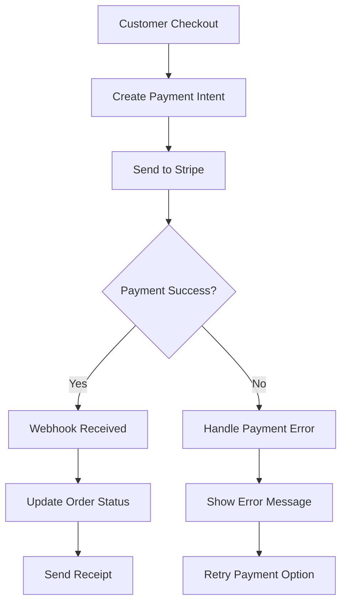

# Integration Notes Documentation

## Overview
This document outlines integration requirements, APIs, webhooks, and third-party service connections for the multi-page role-based POS system. It covers payment processing, shipping, notifications, and business intelligence integrations.

## Payment Gateway Integrations

### 1. Stripe Integration

#### Configuration
```json
{
    "provider": "stripe",
    "api_version": "2023-10-16",
    "endpoints": {
        "base_url": "https://api.stripe.com/v1",
        "payment_intents": "/payment_intents",
        "customers": "/customers",
        "refunds": "/refunds"
    },
    "credentials": {
        "publishable_key": "pk_live_...",
        "secret_key": "sk_live_...",
        "webhook_secret": "whsec_..."
    },
    "supported_methods": ["card", "apple_pay", "google_pay"],
    "currencies": ["USD", "EUR", "GBP", "CAD"]
}
```

#### Payment Processing Flow


#### Webhook Implementation
```python
@csrf_exempt
def stripe_webhook(request):
    payload = request.body
    sig_header = request.META.get('HTTP_STRIPE_SIGNATURE')
    endpoint_secret = settings.STRIPE_WEBHOOK_SECRET
    
    try:
        event = stripe.Webhook.construct_event(
            payload, sig_header, endpoint_secret
        )
    except ValueError:
        return HttpResponse(status=400)
    except stripe.error.SignatureVerificationError:
        return HttpResponse(status=400)
    
    # Handle the event
    if event['type'] == 'payment_intent.succeeded':
        payment_intent = event['data']['object']
        handle_successful_payment(payment_intent)
    elif event['type'] == 'payment_intent.payment_failed':
        payment_intent = event['data']['object']
        handle_failed_payment(payment_intent)
    
    return HttpResponse(status=200)
```

#### Sample Webhook Payload
```json
{
    "id": "evt_1234567890",
    "object": "event",
    "type": "payment_intent.succeeded",
    "data": {
        "object": {
            "id": "pi_1234567890",
            "amount": 2000,
            "currency": "usd",
            "customer": "cus_1234567890",
            "metadata": {
                "order_id": "ord_1234567890",
                "store_id": "store_123"
            },
            "status": "succeeded"
        }
    },
    "created": 1677649600
}
```

### 2. PayPal Integration

#### Configuration
```json
{
    "provider": "paypal",
    "environment": "production", // or "sandbox"
    "endpoints": {
        "base_url": "https://api.paypal.com",
        "orders": "/v2/checkout/orders",
        "captures": "/v2/payments/captures",
        "refunds": "/v2/payments/refunds"
    },
    "credentials": {
        "client_id": "AYjcyDQQpLO2rp4cOiZhCb...",
        "client_secret": "EGNHPxlKQ7bJdFXi...",
        "webhook_id": "8PT597110X687430LKGECATA"
    }
}
```

#### Order Processing
```javascript
// Frontend PayPal integration
paypal.Buttons({
    createOrder: function(data, actions) {
        return fetch('/api/paypal/create-order', {
            method: 'POST',
            headers: {
                'Content-Type': 'application/json'
            },
            body: JSON.stringify({
                cart: getCartItems(),
                order_id: getCurrentOrderId()
            })
        }).then(response => response.json())
          .then(data => data.paypal_order_id);
    },
    onApprove: function(data, actions) {
        return fetch('/api/paypal/capture-order', {
            method: 'POST',
            headers: {
                'Content-Type': 'application/json'
            },
            body: JSON.stringify({
                paypal_order_id: data.orderID,
                order_id: getCurrentOrderId()
            })
        }).then(response => {
            if (response.ok) {
                showSuccessMessage();
                redirectToReceipt();
            }
        });
    }
}).render('#paypal-button-container');
```

### 3. Local Payment Gateway (Vietnam)

#### VNPay Integration
```json
{
    "provider": "vnpay",
    "endpoints": {
        "payment_url": "https://sandbox.vnpayment.vn/paymentv2/vpcpay.html",
        "query_url": "https://sandbox.vnpayment.vn/merchant_webapi/api/transaction"
    },
    "credentials": {
        "merchant_id": "2QXUI4J4",
        "hash_secret": "GKIKCOQGNQPEOVLTKR...",
        "return_url": "https://yourstore.com/payment/vnpay/return",
        "notify_url": "https://yourstore.com/webhooks/vnpay"
    },
    "supported_banks": ["VNPAYQR", "VNBANK", "INTCARD"],
    "currency": "VND"
}
```

## Shipping API Integrations

### 1. FedEx Integration

#### Rate Calculation
```python
import requests

def get_fedex_shipping_rates(order_data):
    """Calculate shipping rates using FedEx API"""
    
    payload = {
        "accountNumber": {
            "value": settings.FEDEX_ACCOUNT_NUMBER
        },
        "requestedShipment": {
            "shipper": {
                "address": {
                    "postalCode": order_data['origin_zip'],
                    "countryCode": "US"
                }
            },
            "recipient": {
                "address": {
                    "postalCode": order_data['destination_zip'],
                    "countryCode": "US"
                }
            },
            "requestedPackageLineItems": [
                {
                    "weight": {
                        "units": "LB",
                        "value": order_data['weight']
                    },
                    "dimensions": {
                        "length": order_data['length'],
                        "width": order_data['width'],
                        "height": order_data['height'],
                        "units": "IN"
                    }
                }
            ]
        }
    }
    
    response = requests.post(
        "https://apis.fedex.com/rate/v1/rates/quotes",
        json=payload,
        headers={
            "Authorization": f"Bearer {get_fedex_token()}",
            "Content-Type": "application/json"
        }
    )
    
    return response.json()
```

### 2. UPS Integration

#### Tracking Updates
```python
def get_ups_tracking_info(tracking_number):
    """Get package tracking information from UPS"""
    
    url = f"https://onlinetools.ups.com/api/track/v1/details/{tracking_number}"
    
    headers = {
        "Authorization": f"Bearer {get_ups_token()}",
        "Accept": "application/json"
    }
    
    response = requests.get(url, headers=headers)
    
    if response.status_code == 200:
        tracking_data = response.json()
        return parse_ups_tracking_data(tracking_data)
    
    return None

def parse_ups_tracking_data(data):
    """Parse UPS tracking response"""
    shipment = data['trackResponse']['shipment'][0]
    
    return {
        "tracking_number": shipment['inquiryNumber'],
        "status": shipment['package'][0]['currentStatus']['description'],
        "delivery_date": shipment.get('deliveryDate', {}).get('date'),
        "activities": [
            {
                "date": activity['date'],
                "time": activity['time'],
                "location": activity['location']['address'],
                "status": activity['status']['description']
            }
            for activity in shipment['package'][0]['activity']
        ]
    }
```

## Communication Service Integrations

### 1. Twilio SMS Integration

#### SMS Notification Service
```python
from twilio.rest import Client

class SMSService:
    def __init__(self):
        self.client = Client(
            settings.TWILIO_ACCOUNT_SID,
            settings.TWILIO_AUTH_TOKEN
        )
        self.from_number = settings.TWILIO_PHONE_NUMBER
    
    def send_order_notification(self, phone_number, order_data):
        """Send order status SMS notification"""
        
        message_body = self.format_order_message(order_data)
        
        try:
            message = self.client.messages.create(
                body=message_body,
                from_=self.from_number,
                to=phone_number
            )
            return {
                "success": True,
                "message_sid": message.sid,
                "status": message.status
            }
        except Exception as e:
            return {
                "success": False,
                "error": str(e)
            }
    
    def format_order_message(self, order_data):
        return f"""
Hi {order_data['customer_name']}!

Your order #{order_data['order_number']} is {order_data['status']}.
Total: ${order_data['total_amount']:.2f}

Track your order: {order_data['tracking_url']}

Thank you for shopping with {order_data['store_name']}!
        """.strip()
```

### 2. SendGrid Email Integration

#### Email Template Service
```python
import sendgrid
from sendgrid.helpers.mail import Mail, Email, To, Content

class EmailService:
    def __init__(self):
        self.sg = sendgrid.SendGridAPIClient(
            api_key=settings.SENDGRID_API_KEY
        )
    
    def send_receipt_email(self, order_data):
        """Send order receipt via email"""
        
        from_email = Email("noreply@yourstore.com", "Your Store")
        to_email = To(order_data['customer_email'])
        subject = f"Receipt for Order #{order_data['order_number']}"
        
        # Use dynamic template
        message = Mail(
            from_email=from_email,
            to_emails=to_email,
            subject=subject
        )
        
        message.template_id = "d-1234567890abcdef1234567890abcdef"
        message.dynamic_template_data = {
            "customer_name": order_data['customer_name'],
            "order_number": order_data['order_number'],
            "order_date": order_data['created_at'],
            "items": order_data['items'],
            "subtotal": order_data['subtotal'],
            "tax_amount": order_data['tax_amount'],
            "total_amount": order_data['total_amount'],
            "store_name": order_data['store_name'],
            "store_address": order_data['store_address']
        }
        
        try:
            response = self.sg.send(message)
            return {
                "success": True,
                "status_code": response.status_code
            }
        except Exception as e:
            return {
                "success": False,
                "error": str(e)
            }
```

### 3. Firebase Push Notifications

#### Mobile Push Service
```javascript
// Firebase Cloud Messaging setup
import { initializeApp } from 'firebase/app';
import { getMessaging, getToken, onMessage } from 'firebase/messaging';

const firebaseConfig = {
    apiKey: "AIzaSyB...",
    authDomain: "yourstore-pos.firebaseapp.com",
    projectId: "yourstore-pos",
    storageBucket: "yourstore-pos.appspot.com",
    messagingSenderId: "123456789",
    appId: "1:123456789:web:abcdef123456"
};

const app = initializeApp(firebaseConfig);
const messaging = getMessaging(app);

// Register for push notifications
export async function registerForPushNotifications() {
    try {
        const token = await getToken(messaging, {
            vapidKey: 'BL...'
        });
        
        if (token) {
            // Send token to backend
            await fetch('/api/notifications/register-device', {
                method: 'POST',
                headers: {
                    'Content-Type': 'application/json',
                    'Authorization': `Bearer ${getAuthToken()}`
                },
                body: JSON.stringify({
                    fcm_token: token,
                    device_type: 'web'
                })
            });
        }
    } catch (error) {
        console.error('Push notification registration failed:', error);
    }
}

// Handle foreground messages
onMessage(messaging, (payload) => {
    const { notification } = payload;
    
    // Show in-app notification
    showInAppNotification({
        title: notification.title,
        body: notification.body,
        data: payload.data
    });
});
```

## Business Intelligence Integrations

### 1. Google Analytics 4 Integration

#### E-commerce Tracking
```javascript
// GA4 e-commerce events
function trackPurchase(orderData) {
    gtag('event', 'purchase', {
        transaction_id: orderData.order_number,
        value: orderData.total_amount,
        currency: 'USD',
        items: orderData.items.map(item => ({
            item_id: item.product_id,
            item_name: item.product_name,
            category: item.category,
            quantity: item.quantity,
            price: item.unit_price
        }))
    });
}

function trackAddToCart(productData) {
    gtag('event', 'add_to_cart', {
        currency: 'USD',
        value: productData.price * productData.quantity,
        items: [{
            item_id: productData.product_id,
            item_name: productData.product_name,
            category: productData.category,
            quantity: productData.quantity,
            price: productData.price
        }]
    });
}
```

### 2. Mixpanel Analytics

#### Custom Event Tracking
```python
from mixpanel import Mixpanel

class AnalyticsService:
    def __init__(self):
        self.mp = Mixpanel(settings.MIXPANEL_PROJECT_TOKEN)
    
    def track_order_created(self, order_data, user_id):
        """Track order creation event"""
        
        self.mp.track(user_id, 'Order Created', {
            'order_id': order_data['id'],
            'order_number': order_data['order_number'],
            'total_amount': order_data['total_amount'],
            'payment_method': order_data['payment_method'],
            'item_count': len(order_data['items']),
            'store_id': order_data['store_id'],
            'is_repeat_customer': order_data['customer']['visit_count'] > 1
        })
    
    def track_inventory_alert(self, product_data, store_id):
        """Track low inventory alerts"""
        
        self.mp.track(store_id, 'Low Stock Alert', {
            'product_id': product_data['id'],
            'product_name': product_data['name'],
            'current_stock': product_data['quantity'],
            'min_stock': product_data['min_stock'],
            'category': product_data['category']['name']
        })
```

## Accounting Software Integrations

### 1. QuickBooks Online Integration

#### Invoice Synchronization
```python
from intuitlib.client import AuthClient
from quickbooks import QuickBooks

class QuickBooksService:
    def __init__(self):
        self.auth_client = AuthClient(
            client_id=settings.QB_CLIENT_ID,
            client_secret=settings.QB_CLIENT_SECRET,
            environment=settings.QB_ENVIRONMENT,
            redirect_uri=settings.QB_REDIRECT_URI
        )
    
    def sync_order_to_invoice(self, order_data):
        """Create QuickBooks invoice from order"""
        
        qb = QuickBooks(
            auth_client=self.auth_client,
            refresh_token=self.get_refresh_token(),
            company_id=settings.QB_COMPANY_ID
        )
        
        # Create customer if not exists
        customer = self.get_or_create_customer(qb, order_data['customer'])
        
        # Create invoice
        invoice_data = {
            "CustomerRef": {"value": customer.Id},
            "Line": [
                {
                    "Amount": item['total_amount'],
                    "DetailType": "SalesItemLineDetail",
                    "SalesItemLineDetail": {
                        "ItemRef": {"value": self.get_item_ref(item['product_id'])},
                        "Qty": item['quantity'],
                        "UnitPrice": item['unit_price']
                    }
                }
                for item in order_data['items']
            ]
        }
        
        invoice = qb.create_invoice(invoice_data)
        return invoice
```

### 2. Xero Integration

#### Financial Data Export
```python
from xero_python.api_client import ApiClient
from xero_python.accounting import AccountingApi

class XeroService:
    def __init__(self):
        self.api_client = ApiClient(
            ClientId=settings.XERO_CLIENT_ID,
            ClientSecret=settings.XERO_CLIENT_SECRET
        )
        self.accounting_api = AccountingApi(self.api_client)
    
    def export_daily_sales(self, date, store_id):
        """Export daily sales to Xero"""
        
        sales_data = self.get_daily_sales_summary(date, store_id)
        
        # Create bank transaction for daily sales
        bank_transaction = {
            "Type": "RECEIVE",
            "Contact": {"Name": "Daily Sales"},
            "Date": date,
            "LineItems": [
                {
                    "Description": f"Daily sales - {payment_method}",
                    "UnitAmount": amount,
                    "AccountCode": self.get_account_code(payment_method)
                }
                for payment_method, amount in sales_data['payment_breakdown'].items()
            ],
            "BankAccount": {"Code": settings.XERO_BANK_ACCOUNT_CODE}
        }
        
        response = self.accounting_api.create_bank_transactions(
            settings.XERO_TENANT_ID,
            bank_transaction
        )
        
        return response
```

## Webhook Management System

### Webhook Registration
```python
class WebhookManager:
    def __init__(self):
        self.webhooks = {}
    
    def register_webhook(self, provider, event_type, handler_func):
        """Register webhook handler for specific provider and event"""
        
        key = f"{provider}:{event_type}"
        self.webhooks[key] = handler_func
        
        logging.info(f"Registered webhook handler for {key}")
    
    def process_webhook(self, provider, event_type, payload, headers):
        """Process incoming webhook"""
        
        key = f"{provider}:{event_type}"
        handler = self.webhooks.get(key)
        
        if not handler:
            logging.warning(f"No handler found for webhook {key}")
            return False
        
        try:
            # Verify webhook signature
            if not self.verify_signature(provider, payload, headers):
                logging.error(f"Invalid signature for webhook {key}")
                return False
            
            # Process webhook
            result = handler(payload)
            logging.info(f"Successfully processed webhook {key}")
            return result
            
        except Exception as e:
            logging.error(f"Error processing webhook {key}: {str(e)}")
            return False
    
    def verify_signature(self, provider, payload, headers):
        """Verify webhook signature based on provider"""
        
        verifiers = {
            'stripe': self.verify_stripe_signature,
            'paypal': self.verify_paypal_signature,
            'sendgrid': self.verify_sendgrid_signature
        }
        
        verifier = verifiers.get(provider)
        if verifier:
            return verifier(payload, headers)
        
        return True  # No verification for unknown providers
```

### Webhook Retry Logic
```python
from celery import shared_task
import time
import random

@shared_task(bind=True, max_retries=5)
def process_webhook_with_retry(self, webhook_data):
    """Process webhook with exponential backoff retry"""
    
    try:
        # Process webhook
        result = webhook_manager.process_webhook(**webhook_data)
        
        if not result:
            raise Exception("Webhook processing failed")
        
        return result
        
    except Exception as exc:
        # Calculate backoff delay
        countdown = (2 ** self.request.retries) + random.uniform(0, 1)
        
        # Log retry attempt
        logging.warning(
            f"Webhook processing failed, retrying in {countdown}s. "
            f"Attempt {self.request.retries + 1} of {self.max_retries}"
        )
        
        # Retry with backoff
        raise self.retry(exc=exc, countdown=countdown)
```

## Integration Monitoring and Health Checks

### Health Check Endpoints
```python
from django.http import JsonResponse
import requests
from datetime import datetime, timedelta

def integration_health_check(request):
    """Check health of all integrations"""
    
    health_status = {}
    
    # Check payment gateways
    health_status['stripe'] = check_stripe_health()
    health_status['paypal'] = check_paypal_health()
    
    # Check shipping APIs
    health_status['fedex'] = check_fedex_health()
    health_status['ups'] = check_ups_health()
    
    # Check communication services
    health_status['twilio'] = check_twilio_health()
    health_status['sendgrid'] = check_sendgrid_health()
    
    # Check analytics
    health_status['mixpanel'] = check_mixpanel_health()
    
    # Overall status
    overall_status = all(
        status.get('status') == 'healthy' 
        for status in health_status.values()
    )
    
    return JsonResponse({
        'overall_status': 'healthy' if overall_status else 'degraded',
        'timestamp': datetime.now().isoformat(),
        'services': health_status
    })

def check_stripe_health():
    """Check Stripe API health"""
    try:
        response = requests.get(
            "https://api.stripe.com/v1/balance",
            headers={"Authorization": f"Bearer {settings.STRIPE_SECRET_KEY}"},
            timeout=5
        )
        
        if response.status_code == 200:
            return {
                'status': 'healthy',
                'response_time': response.elapsed.total_seconds(),
                'last_check': datetime.now().isoformat()
            }
        else:
            return {
                'status': 'unhealthy',
                'error': f"HTTP {response.status_code}",
                'last_check': datetime.now().isoformat()
            }
    except Exception as e:
        return {
            'status': 'unhealthy',
            'error': str(e),
            'last_check': datetime.now().isoformat()
        }
```

### Integration Error Handling
```python
class IntegrationError(Exception):
    """Base exception for integration errors"""
    pass

class PaymentGatewayError(IntegrationError):
    """Payment gateway specific errors"""
    pass

class ShippingAPIError(IntegrationError):
    """Shipping API specific errors"""
    pass

def handle_integration_error(func):
    """Decorator for handling integration errors"""
    def wrapper(*args, **kwargs):
        try:
            return func(*args, **kwargs)
        except requests.RequestException as e:
            # Network/HTTP errors
            log_integration_error('network', func.__name__, str(e))
            raise IntegrationError(f"Network error: {str(e)}")
        except PaymentGatewayError as e:
            # Payment specific errors
            log_integration_error('payment', func.__name__, str(e))
            raise
        except Exception as e:
            # Generic errors
            log_integration_error('general', func.__name__, str(e))
            raise IntegrationError(f"Integration error: {str(e)}")
    
    return wrapper

def log_integration_error(error_type, function_name, error_message):
    """Log integration errors for monitoring"""
    logging.error(
        f"Integration error in {function_name}: {error_message}",
        extra={
            'error_type': error_type,
            'function': function_name,
            'timestamp': datetime.now().isoformat()
        }
    )
```

## Configuration Management

### Environment-Specific Configurations
```python
# Integration configurations for different environments
INTEGRATION_CONFIGS = {
    'development': {
        'stripe': {
            'api_key': 'sk_test_...',
            'webhook_secret': 'whsec_test_...',
            'base_url': 'https://api.stripe.com/v1'
        },
        'paypal': {
            'environment': 'sandbox',
            'client_id': 'test_client_id',
            'base_url': 'https://api.sandbox.paypal.com'
        }
    },
    'production': {
        'stripe': {
            'api_key': 'sk_live_...',
            'webhook_secret': 'whsec_live_...',
            'base_url': 'https://api.stripe.com/v1'
        },
        'paypal': {
            'environment': 'production',
            'client_id': 'live_client_id',
            'base_url': 'https://api.paypal.com'
        }
    }
}
```

This comprehensive documentation provides backend developers with all the necessary information to integrate external services, handle webhooks, manage API communications, and maintain system health across various third-party platforms.